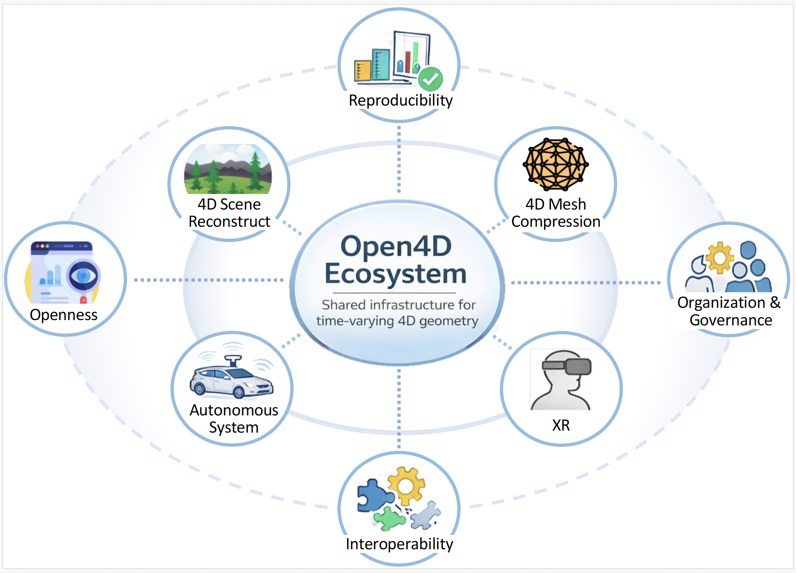

# Open4D

Open4D is a research repository for representing, compressing, evaluating, and
playing time-varying 3D geometry. It brings several mesh-compression systems,
an experimental Open4D container format, viewers, and benchmark tooling into
one workspace for XR, teleoperation, digital-twin, robotics, and graphics
research.

> **Project status:** Open4D is under active development. The individual
> research modules contain working pipelines, while the shared 4D data model,
> common metrics API, and repository-wide benchmark suite are not yet stable.

<p align="center">
  
</p>

## Repository layout

```text
Open4D/
├── open4d/
│   ├── core/          planned shared sequence and metadata abstractions
│   ├── io/            experimental .o4d mesh and point-cloud containers
│   ├── player/        PyQt/OpenGL sequence viewers
│   ├── tools/         conversion utilities for .o4d files
│   └── modules/
│       ├── N4MC/
│       ├── Quantized-Neural-Displacement-Fields/
│       ├── tsmc/
│       ├── tvmc/
│       └── unity_decoder/
├── benchmarks/        benchmark scaffolding and research baselines
├── examples/          minimal .o4d playback examples
├── scripts/           repository-level setup utilities
├── tests/             repository test-suite placeholder
└── docs/              architecture and repository policies
```

There are currently no top-level `cpp/`, `python/`, or `docker/` directories.
Native C++, C#, and build files are owned by the research modules that require
them.

## Components

### Open4D IO and players

`open4d/io` implements version-1 chunked containers for mesh sequences, raw
point-cloud sequences, and Draco-compressed point-cloud sequences. The matching
tools convert folders of geometry files into `.o4d` containers, and the players
provide local desktop playback.

The abstractions described in `open4d/core/README.md`—including
`MeshSequence`, `PointCloudSequence`, transforms, timestamps, and frame
metadata—are planned work. Research modules do not yet share a single stable
Python API.

### Research modules

- **N4MC** — neural TSDF-based mesh compression, including a newer modular
  codec under its `data`, `models`, `losses`, `training`, and `evaluation`
  packages.
- **Quantized Neural Displacement Fields (QNDF)** — static mesh compression
  using an SSP coarse mesh and an implicit displacement decoder.
- **TVMC** — a Python, .NET, and Draco pipeline for tracked time-varying mesh
  compression. It includes setup and resumable pipeline scripts.
- **TSMC** — scene-mesh compression with optional SAM-based static/dynamic
  separation, ARAP volume tracking, deformation, displacement compression, and
  evaluation.
- **Unity decoder** — a C++ decoder backend and C# Unity front end for playback
  on XR targets.

Each module has its own README and environment requirements. TVMC currently
targets Python 3.10; TSMC targets Python 3.12. Treat module environments as
independent until a shared environment is documented.

## Installation

Clone with submodules so both TVMC and TSMC receive their pinned Draco source:

```bash
git clone --recurse-submodules https://github.com/SINRG-Lab/Open4D.git
cd Open4D
```

For the lightweight `.o4d` IO package:

```bash
python -m venv .venv
source .venv/bin/activate
python -m pip install --upgrade pip
python -m pip install -e .
```

Optional local tooling is available through extras:

```bash
python -m pip install -e ".[tools]"   # trimesh conversion tools
python -m pip install -e ".[draco]"  # Draco point-cloud support
python -m pip install -e ".[player]" # desktop viewers
python -m pip install -e ".[all]"
```

These extras do not install the heavyweight research-module environments. Use
the setup instructions inside the selected module before running a codec.

If an existing clone is missing Draco, initialize and build both copies with:

```bash
./scripts/setup_draco.sh
```

## Reproducibility and artifacts

Do not commit local datasets, virtual environments, benchmark jobs, training
runs, checkpoints, logs, or decoded outputs. The expected local directories,
publication-manifest requirements, and policy for existing historical fixtures
are documented in [`docs/artifacts.md`](docs/artifacts.md).

The repository-wide `benchmarks/` and `tests/` directories are currently
scaffolding rather than a complete validation suite. Results should identify
the exact module revision, configuration, dataset/frame range, encoded byte
count, runtime environment, and metric implementation.

## Contributing

Contributions are welcome, especially around shared data abstractions, common
metrics, reproducible benchmark fixtures, module adapters, tests, documentation,
and performance. Keep research-module dependencies isolated and document any
new binary fixture or external artifact alongside the code that consumes it.

Please contact the Open4D maintainers before adding a large dataset, checkpoint,
or third-party source tree.
