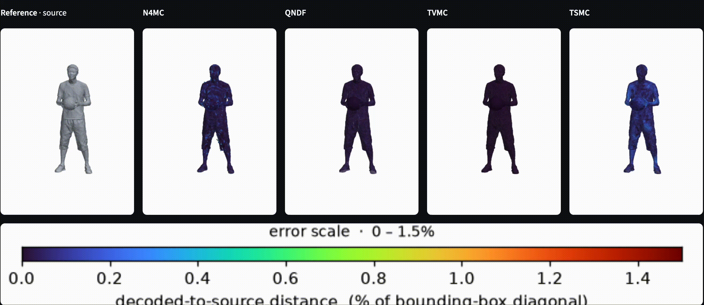
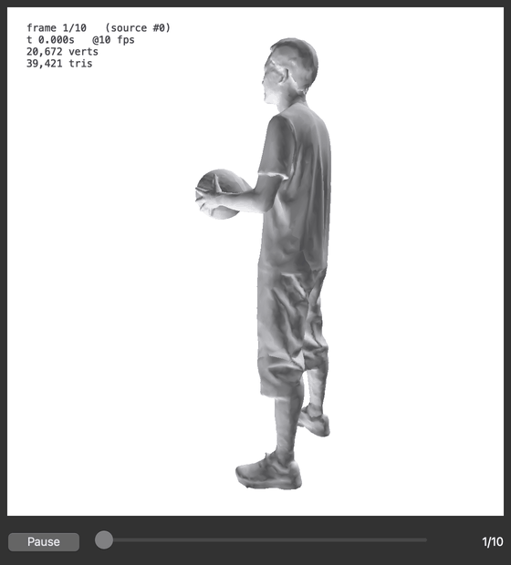

# Open4D

 

## Tools for 3D data that changes over time

Open4D brings code for loading, viewing, compressing, and comparing mesh and
point-cloud sequences into one open-source research project. In this project,
**4D** means 3D geometry that changes over time.

[Try the sequence viewer](#try-the-sequence-viewer) |
[Browse the codecs](#codecs-reconstruction-and-integrations) |
[Read the contributor handbook](#contributor-handbook)

<p align="center">
  
</p>

<p align="center"><em>A reference sequence beside results from four research codecs. Colour shows distance from the reference.</em></p>

### What works today

- A small Python model for triangle meshes, frames, and finite sequences.
- One-file OpenUSD and Open4D codec sequences, plus `.obj`/`.ply` import paths.
- A viewer for inspecting, playing, scrubbing, and exporting mesh sequences.
- A comparison tool that measures a decoded sequence against its reference and
  displays both under one camera.
- Research codecs for mesh compression, plus RGB-D reconstruction and Open3D
  and Unity integrations. These larger components still have their own setup
  and dependencies.

### Try the sequence viewer

The lightweight viewer runs on macOS, Linux, and Windows and does not need a
GPU. Its normal input is one 4D sequence file:

```bash
git clone https://github.com/open4dfoundation/Open4D.git
cd Open4D
python -m venv .venv
source .venv/bin/activate
python -m pip install -e '.[player,usd]'
python examples/visualization/visualize_sequence.py capture.usdc --info
python examples/visualization/visualize_sequence.py capture.usdc
```

On Windows, activate the environment with `.venv\Scripts\activate` instead.
See the [visualization guide](examples/visualization/README.md) for supported
inputs, controls, OpenUSD packing, and sequence comparison.

<p align="center">
  
</p>

> **Project status:** Open4D is early research software. The core data model,
> viewer, comparison tool, and individual research components work today, but
> the shared API and complete cross-codec workflows are still being built.

## Contributor handbook

New contributors should start with the
[Open4D Wiki](https://github.com/open4dfoundation/Open4D/wiki) or the versioned
[`v0.2-dev` handbook source](docs/handbook/v0.2-dev/README.md). The handbook
explains 3D/4D representations from first principles, maps every repository
area, separates verified behavior from research claims, and provides the
dependency-ordered roadmap.

> **Release safety:** redistribution is currently blocked while the
> third-party provenance and license audit is incomplete. See
> [`THIRD_PARTY.md`](THIRD_PARTY.md).

## Repository layout

```text
Open4D/
├── open4d/
│   ├── core/          shared temporal geometry and sequence abstractions
│   ├── io/            public mesh-file and manifested-directory I/O
│   ├── codec/         shared sequence codec API and adapters
│   ├── visualization/ public viewer and GIF renderer
│   ├── torch_ops/      optional Torch geometry helpers
│   ├── codecs/
│   │   ├── draco/
│   │   ├── faster_vdmc/
│   │   ├── klt/
│   │   ├── n4mc/
│   │   ├── qndf/
│   │   ├── qndf_int8/
│   │   ├── tsmc/
│   │   ├── tvmc/
│   │   └── vdmc/
│   └── reconstruction/
│       ├── rgbd/
│       ├── queen/
│       ├── 3dgstream/
│       └── gs_tools/
├── integrations/
│   ├── open3d/
│   └── unity/
├── examples/
│   └── visualization/ runnable sequence loading, visualization, and
│                      reference-versus-decoded comparison
├── apps/              placeholder for end-to-end pipelines; a README only
├── scripts/           repository-level setup utilities
└── docs/              architecture and repository policies
```

<p align="center">
  
</p>

### Codecs, reconstruction, and integrations

- **N4MC** — neural TSDF-based mesh compression, including a newer modular
  codec under its `data`, `models`, `losses`, `training`, and `evaluation`
  packages.
- **Quantized Neural Displacement Fields (QNDF)** — static mesh compression
  using an SSP coarse mesh and an implicit displacement decoder.
- **TVMC** — a Python, .NET, and Draco pipeline for tracked time-varying mesh
  compression. It includes setup and resumable pipeline scripts.
- **TSMC** — scene-mesh compression with optional SAM-based static/dynamic
  separation, ARAP volume tracking, deformation, displacement compression, and
  evaluation.
- **Unity integration** — a C++ decoder backend and C# Unity front end for
  playback on XR targets.
- **Draco** — Google Draco mesh-compression baseline. Wraps the vendored
  `draco_encoder`/`draco_decoder` binaries into a per-frame encode/decode/eval
  pipeline for benchmarking against the neural codecs.
- **KLT** — Karhunen–Loève Transform baseline that compresses TSDF voxel blocks
  with a learned linear basis and quantized coefficients, reconstructing meshes
  via marching cubes.
- **4D reconstruction** — synchronized multi-camera RGB-D ingestion, calibrated
  point-cloud fusion, CUDA TSDF mesh reconstruction, and live browser playback.
  It includes both the original native reconstruction code and the Python
  two-camera streaming pipeline.
- **MPEG V-DMC test model** — the pinned MPEG reference implementation for
  video-based dynamic mesh coding. The `open4d/codecs/vdmc` submodule provides
  the standard's reference encoder, decoder, metric tools, and unit tests; it is
  separate from Open4D's TVMC research pipeline.
- **Faster V-DMC** — a pinned performance-oriented fork of the same test model,
  with exact-output and higher-throughput modes recorded in the
  [benchmark report](docs/benchmarks/faster-vdmc.md).

Each component has its own README and may add native tools, GPU extensions, or
hardware requirements to the shared Python baseline. See
[Requirements](#requirements) for those additions.

## Requirements

One baseline covers the repository itself — the shared data model and
`examples/visualization`:

| | |
|---|---|
| Python | 3.10–3.13 |
| Operating system | macOS, Linux, or Windows |
| CPU | Any x86-64 or arm64; no particular core count |
| GPU | Not required. The viewers open a real OpenGL window, so a graphical session is needed even for `--save` |
| Memory | Roughly 1 MB of RAM per frame of playback. |
| Disk | About 1.5 GB for a clone with submodules initialized|

`pip install -e .` needs only NumPy, and reads `.obj` and `.ply` with no further
dependencies. Extras add optional readers and viewers — see
[Installation](#installation). The comparison program additionally needs SciPy,
which the `[player]` extra installs, for its nearest-neighbour search — the same
`cKDTree` query TVMC's own evaluation uses.

### One Python dependency set for the codecs

The supported baseline for codec Python stages is described by
[`environment.yml`](environment.yml) at the repository root:

```bash
conda env create -f environment.yml
conda activate open4d
pip install -e .
```

The Python set is Python 3.12, NumPy 1.26.4, Open3D 0.19, and PyTorch 2.7.0.
Native projects use one external .NET 10 SDK. This replaces three Python
versions, two Open3D versions, two PyTorch versions, and three .NET targets. The
Python pins themselves live in
[`requirements-codecs.txt`](requirements-codecs.txt), which `environment.yml`
installs; it lists direct dependencies only, so inside an existing Python 3.12
environment `pip install -r requirements-codecs.txt` is equivalent.

Codec-local setup scripts may create a convenience virtual environment, but
they must use these same Python and package pins rather than defining a second
dependency baseline. Native tools and GPU extensions remain separate.

One trap worth naming, because its error message points the wrong way. The .NET
projects target `net10.0`, and a distribution's own `dotnet` under
`/usr/lib/dotnet` will shadow a newer SDK in `~/.dotnet` on `PATH`. The build
then fails with `NETSDK1045: The current .NET SDK does not support targeting
.NET 10.0`, which reads as a missing SDK when the SDK is usually installed and
merely second in line. Check with `dotnet --list-sdks` before installing
anything. Downgrading the projects to `net9.0` is not the fix: .NET 9 left
support in May 2026, and moving off end-of-life targets is why they are on
`net10.0`.

Some codecs additionally need compiled extensions that pip cannot resolve from a
version number alone, because each is built against one exact PyTorch and CUDA
build. Those are optional and separate, with install commands in
[`requirements-gpu.txt`](requirements-gpu.txt):

| Extra | Needed by |
|---|---|
| `cupy-cuda12x` | `n4mc`, `tsmc` |
| `torch-scatter` | `n4mc` |
| `nvdiffrast` | `n4mc` |
| `kaolin` | `n4mc`, `klt` |

What each module needs beyond that shared environment:

| Module | Adds |
|---|---|
| `codecs/tvmc` | .NET 10 SDK, CMake; Homebrew macOS or Ubuntu |
| `codecs/tsmc` | .NET 10 SDK, SAM3, `cupy`; Ubuntu 24.04, tested against Meta Quest 3. `convert_to_std_obj.py` runs inside Blender, which supplies `bpy` |
| `codecs/n4mc` | All four GPU extras and an NVIDIA GPU — 24 GB holds only about two training frames at resolution 256 |
| `codecs/qndf`, `codecs/qndf_int8` | An NVIDIA GPU for training. Evaluation (`mesh_errors.py`) runs on CPU. Building the `ssp_remesh` preprocessor needs CMake and Eigen (`libeigen3-dev`/`brew install eigen`), plus the pinned libigl submodule |
| `codecs/klt` | `kaolin` and an NVIDIA GPU; 24 GB is the same ceiling at resolution 128–256 |
| `codecs/draco` | A CMake build of the vendored Draco submodule. Open3D, pymeshlab, and OpenCV are for evaluation only |
| `codecs/vdmc`, `codecs/faster_vdmc` | The MPEG reference and optimized test models' own build requirements |
| `reconstruction/rgbd` | Two hardware-synchronized RGB-D cameras, a Windows capture host, and an Ubuntu host with Python 3.10+, an NVIDIA GPU, and CUDA-enabled Open3D. Its legacy C++ pipeline additionally wants CUDA 12.x, Open3D 0.18, OpenCV, Eigen, jsoncpp, Draco, CMake, Ninja, and either the Azure Kinect SDK or the Orbbec K4A wrapper |
| `integrations/unity` | Unity, plus a C++ toolchain to rebuild the backend for anything other than the prebuilt macOS and Android/Quest 3 plugins |

Open3D ships no 3.13 wheels, capping .[open3d] and the codecs at 3.12.

### RGB-D capture on Windows

The RGB-D capture host is Windows and only encodes and forwards frames, so it needs no NVIDIA GPU: just the camera vendor SDK (tested: Orbbec K4A Wrapper 1.10.5, SDK 1.10.28, two Femto Bolts), both cameras on separate USB 3 ports with a sync hub, and an OpenSSH client. Close Orbbec Viewer first or the sender fails with Hardware MFT failed to start. 5 synchronized pairs/s held over Wi-Fi and VPN; 15 did not.

Calibration layout and the step-by-step session walkthrough are in
[`open4d/reconstruction/rgbd/README.md`](open4d/reconstruction/rgbd/README.md),
which covers how to run the pipeline and leaves requirements to this page.

## Installation

Clone with submodules to obtain the pinned Draco, libigl, SAM3, and MPEG V-DMC
source:

```bash
git clone --recurse-submodules https://github.com/open4dfoundation/Open4D.git
cd Open4D
```

For the lightweight core package:

```bash
python -m venv .venv
source .venv/bin/activate
python -m pip install --upgrade pip
python -m pip install -e .
```

Optional local tooling is available through extras:

```bash
python -m pip install -e ".[player]" # the example viewer (PyQt6 + pyqtgraph)
python -m pip install -e ".[usd]"    # OpenUSD containers
python -m pip install -e ".[tools]"  # trimesh, for extra mesh formats
python -m pip install -e ".[open3d]" # Open3D adapter; Python 3.12 or older
python -m pip install -e ".[qndf]"  # QNDF/QNDF-INT8 in-process adapters
python -m pip install -e ".[temporal]" # experimental temporal-delta/PCA codecs
python -m pip install -e ".[all]"
```

These extras do not install the heavyweight codec environments. Use the setup
instructions inside the selected codec before running it. Research codec
implementations remain source-checkout-only and are excluded from the
lightweight wheel until their provenance review is complete.

If an existing clone is missing Draco, initialize and build all three copies —
the Draco baseline codec's own, plus TSMC's and TVMC's — with:

```bash
./scripts/setup_draco.sh
```

## Sequence viewer details

The public Python API loads, saves, unloads, and visualizes whole finite
triangle-mesh sequences independently of their storage format:

```python
import open4d

with open4d.load("capture.usdc") as sequence:
    open4d.save(sequence, "capture.o4d")
    open4d.visualize(sequence)

# A path can go straight to the lazy viewer; it is closed when the window exits.
open4d.visualize("capture.o4d")
```

`.usd`, `.usda`, `.usdc`, and `.usdz` are OpenUSD interchange containers.
`.o4d` and the registered codec suffixes are codec artifacts. Both carry whole
sequences and use the same `Sequence` interface. `open4d.unload(sequence)` is an
explicit, idempotent alternative to the context manager.

`write_sequence(sequence, "frames/", format="ply")` writes a versioned
`open4d.sequence.json` beside the frame files, so reopening the directory keeps
source frame indices, timestamps, frame/sequence metadata, and topology
declarations. Empty sequences are rejected before the destination is changed.
Single mesh-file exports require `allow_lossy=True` because that storage cannot
preserve sequence timing, metadata, or topology declarations.
Trimesh-backed OFF/GLB/glTF color export also requires that opt-in because OFF
drops vertex color and GLB/glTF quantize canonical float colors to eight bits.

Five lossless, in-process reference codecs are included: `raw`, `deflate`,
`bzip2`, `lzma`, and byte-level `rle` (`npz` remains the default DEFLATE alias).
They share a safe NumPy-array container so they compare storage strategies, not
research geometry models. Source checkouts register in-process adapters for
`klt`, `n4mc`, `qndf`, and `qndf-int8`; the lightweight wheel omits them until
their provenance review is complete. Open4D's separate `temporal-delta` and
`temporal-pca` experiments are not the repository's TVMC or TSMC pipelines.
The V-DMC adapters do not execute shell scripts, but they do invoke configured
native encoder and decoder processes once per sequence. Callers can also
register another `open4d.codec.Codec`. For an all-registered-codec attempt using
`4d_files/Rafa_Approves_hd_4k`, open
[`examples/open4d_sequence_codec.ipynb`](examples/open4d_sequence_codec.ipynb).
Set `OPEN4D_NOTEBOOK_REQUIRE_ALL=1` in a fully provisioned environment to make
any codec failure stop the notebook instead of appearing only in its result table.
The N4MC and QNDF adapters accept `device="auto"` (CUDA, then Apple Metal/MPS,
then CPU), or an explicit `"cuda"`, `"mps"`, or `"cpu"`. QNDF-int8 can train
on CUDA or Metal, but its quantized decoder remains CPU-only. Override the
notebook selection with `OPEN4D_NOTEBOOK_DEVICE=mps` when needed.

This API slice standardizes files around `Sequence[Frame[TriangleMesh]]`; it is
not yet representation-independent. First-class point-cloud, volume, Gaussian,
and live-stream values require separate contracts.

Normal CI runs dependency-complete CPU encode/fresh-decode contracts for KLT,
N4MC, QNDF, and QNDF-int8. The larger two-format Rafa quality/export matrix is
an additional CUDA acceptance test gated by `OPEN4D_TEST_RESEARCH_CODECS=1` and
`OPEN4D_RAFA_DATASET`; it is not presented as part of ordinary CI coverage.

`examples/visualization/visualize_sequence.py` is the command-line client:

```bash
python examples/visualization/visualize_sequence.py my_capture/ --info
python examples/visualization/visualize_sequence.py my_capture/
```

Playback uses `open4d.visualization`'s PyQt6 window: drag to orbit, scroll to zoom, drag the slider
to scrub, space to pause, left/right to step a frame. `--save out.gif` writes an
animated GIF through the same renderer.

A viewer source may be a single OpenUSD or codec sequence file, one mesh file,
or a folder holding one mesh file per frame. OBJ and PLY need no extra dependency;
the `[tools]` extra adds OFF, STL, GLB, and glTF, while `[usd]` adds OpenUSD
sequence files. `--info` reports frame count, timing, and topology without decoding
geometry, which is the quickest way to check a dataset loads.

Frame folders and individual meshes remain supported as import paths; frames
are decoded on access:

```python
from open4d.io import open_sequence

with open_sequence("path/to/frames", fps=30.0) as sequence:
    print(len(sequence), sequence.duration, sequence.fps)
    mesh = sequence[0].geometry          # TriangleMesh: positions, triangles
```

OpenUSD is the public interchange container. `--pack-usd out.usdc` packs any
source into one compressed `.usdc` file carrying the frame rate, the key-frame
index, and per-frame streams alongside the geometry:

```bash
python -m pip install -e '.[usd]'
python examples/visualization/visualize_sequence.py my_capture/ --pack-usd out.usdc --info
```

The TVMC codec vendors 10 frames of a basketball player, useful for checking the
program runs before pointing it at your own data. See
[`examples/visualization/README.md`](examples/visualization/README.md) for that
command, the full format list, and the container layout.

## Comparing a codec against its reference

`examples/visualization/compare_sequences.py` measures one sequence against
another and shows both at once — the reference as geometry, the decoded mesh
coloured by its distance from it, in synchronized panes under one camera:

```bash
python examples/visualization/compare_sequences.py reference/ decoded/ --info
python examples/visualization/compare_sequences.py reference/ decoded/
```

Error is a nearest-neighbour distance, since a decoded mesh has its own vertex
count and connectivity: point-to-point by default, `--metric plane` for the MPEG
point-to-plane definition. Both are one-sided, so RMS, Hausdorff and PSNR are
reported in each direction and the symmetric figure is the worse of the two.
`--info` prints the per-frame table without opening a window, and `--csv` writes
it for a paper or a regression run.

This is codec-independent: both sides are read through the same loader, so
anything the viewer opens can be compared. It does not replace a codec's own
evaluation — the figures are per-vertex rather than area-weighted over faces, so
they compare codecs against a shared reference rather than substituting for a
metric tool that integrates over the surface.

## Reproducibility and artifacts

Do not commit local datasets, virtual environments, benchmark jobs, training
runs, checkpoints, logs, or decoded outputs. The expected local directories,
publication-manifest requirements, and policy for existing historical fixtures
are documented in [`docs/artifacts.md`](docs/artifacts.md).

Per-codec evaluation still lives inside each codec rather than in a
repository-wide suite; `examples/visualization/compare_sequences.py` is the one
shared piece, covering geometric error between any two sequences the loader can
read. Results should identify the exact component revision, configuration,
dataset/frame range, encoded byte count, runtime environment, and metric
implementation.

## Contributing

Contributions are welcome, especially around shared data abstractions, common
metrics, codec adapters, documentation, and performance. Keep codec
dependencies isolated and document any new binary fixture or external artifact
alongside the code that consumes it.

Please contact the Open4D maintainers before adding a large dataset, checkpoint,
or third-party source tree.

## License

Open4D is distributed under the [MIT License](LICENSE) and is intended to be
useful in academic, educational, and commercial projects. You may use, adapt,
and redistribute the Open4D code subject to the attribution and license-notice
requirements in the license. Bundled third-party components and submodules
remain subject to their respective license terms.

If Open4D contributes to published research, please acknowledge the project
using the repository's [citation metadata](CITATION.cff), and cite the original
papers for any individual codecs, datasets, or algorithms used in your work.
We also welcome feedback through the project's issue tracker: sharing real-world
use cases, limitations, and improvement ideas helps guide future development.
