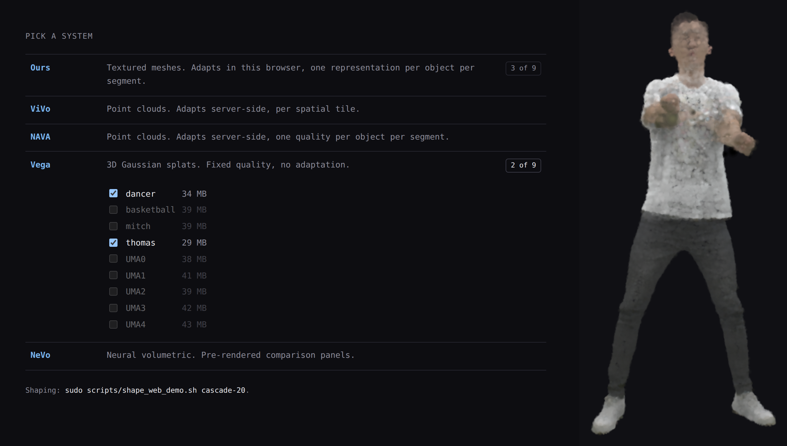

# Open4D: tools for 4D spatial data

<h4>
    <a href="#quick-start">Quick start</a> |
    <a href="docs/requirements.md">Install</a> |
    <a href="examples/visualization/README.md">Viewer &amp; comparison</a> |
    <a href="docs/api.md">Python API</a> |
    <a href="docs/components.md">Components</a> |
    <a href="CONTRIBUTING.md">Contribute</a> |
    <a href="https://github.com/open4dfoundation/Open4D/issues">Issues</a>
</h4>

  

Open4D aims to provide reusable, high-performance libraries and tools for
modern spatial representations, including point clouds, triangle meshes,
Gaussian splats, and future spatial data formats. Our goal is to create a
common open-source infrastructure that accelerates research and development
across applications in XR, robotics, physical AI, autonomous systems, digital
twins, graphics, vision, and spatial computing.

<p align="center">
  
</p>

<p align="center"><em>A reference sequence beside results from four research codecs. Colour shows distance from the reference.</em></p>

## Core features

- A small Python model for frames and finite sequences, over geometry that
  may be a triangle mesh, a point cloud, or a Gaussian cloud.
- One-file OpenUSD and Open4D codec containers, plus `.obj`/`.ply` import paths.
- A viewer for inspecting, playing, scrubbing, and exporting mesh sequences.
  It runs on macOS, Linux, and Windows and does not need a GPU.
- A comparison tool that measures a decoded sequence against its reference and
  displays both under one camera.
- Browser clients for adaptive volumetric streaming, with five systems side by
  side under one bandwidth condition.
- Research codecs for mesh compression, Gaussian-splatting reconstruction and
  streaming, and Open3D and Unity integrations. These larger components still
  have their own setup and dependencies.

## Quick start

The viewer's normal input is one 4D sequence file:

```bash
git clone https://github.com/open4dfoundation/Open4D.git
cd Open4D
python -m venv .venv
source .venv/bin/activate            # Windows: .venv\Scripts\activate
python -m pip install -e '.[player,usd]'

# does it load?
python examples/visualization/visualize_sequence.py capture.usdc --info
# play it
python examples/visualization/visualize_sequence.py capture.usdc
```

Try it on the 10 basketball frames the TVMC codec vendors, if you have no
sequence of your own to hand:

```bash
python examples/visualization/visualize_sequence.py \
    open4d/codecs/tvmc/arap-volume-tracking/data/basketball_player \
    --up y --fps 10 --azimuth 180
```

<p align="center">
  
</p>

In Python:

```python
import open4d

with open4d.load("capture.usdc") as sequence:
    print(len(sequence), sequence.duration, sequence.fps)
    open4d.visualize(sequence)
```

> **Project status:** Open4D is early research software. The core data model,
> viewer, comparison tool, and individual research components work today, but
> the shared API and complete cross-codec workflows are still being built.

> **Release safety:** redistribution is currently blocked while the
> third-party provenance and license audit is incomplete. See
> [`THIRD_PARTY.md`](THIRD_PARTY.md).

## Documentation

| | |
|---|---|
| [Requirements and installation](docs/requirements.md) | The baseline, the one codec dependency set, GPU extras, and what each module adds |
| [Viewer and comparison guide](examples/visualization/README.md) | Supported inputs, flags, controls, reading the error numbers, and OpenUSD packing |
| [Python API](docs/api.md) | Loading, saving, the codec registry, and device selection |
| [Components](docs/components.md) | Every codec, reconstruction module, and integration, with links to their own READMEs |
| [Artifacts policy](docs/artifacts.md) | What not to commit, and what a published result must record |

## Adaptive streaming

[`open4d/webclients`](open4d/webclients) plays volumetric sequences in a
browser and compares delivery methods against each other. Within this
adaptive streaming platform, pick one from the list, or replay a bandwidth
trace and watch them respond to it.

<p align="center">
  
</p>

The clients share one platform-free core, so the browser and desktop clients
run the same segment loop and the same adaptation logic. See
[`open4d/webclients/README.md`](open4d/webclients/README.md) for a quick start and
for how to add your own method.

## Repository layout

```text
open4d/
├── core/            shared temporal geometry and sequence abstractions
├── io/              public mesh-file and manifested-directory I/O
├── codec/           shared sequence codec API and adapters
├── visualization/   public viewer and GIF renderer
├── torch_ops/       optional Torch geometry helpers
├── codecs/          draco, faster_vdmc, klt, n4mc, qndf, qndf_int8, tsmc, tvmc, vdmc
├── reconstruction/  rgbd, queen, 3dgstream, vega, rerf, gs_tools, streamer
└── webclients/      browser clients and the adaptive-streaming logic they share
integrations/        open3d, unity
examples/            runnable sequence loading, visualization, and comparison
scripts/             repository-level setup utilities
docs/                requirements, API, components, and repository policies
```

<p align="center">
  
</p>

## Contributing

Contributions are welcome, especially around shared data abstractions, common
metrics, codec adapters, documentation, and performance. Keep codec
dependencies isolated and document any new binary fixture or external artifact
alongside the code that consumes it. Please contact the maintainers before
adding a large dataset, checkpoint, or third-party source tree. See
[`CONTRIBUTING.md`](CONTRIBUTING.md).

## License and citation

Open4D is distributed under the [MIT License](LICENSE) and is intended to be
useful in academic, educational, and commercial projects. Bundled third-party
components and submodules remain subject to their respective license terms.

If Open4D contributes to published research, please acknowledge the project
using the repository's [citation metadata](CITATION.cff), and cite the original
papers for any individual codecs, datasets, or algorithms used in your work.
