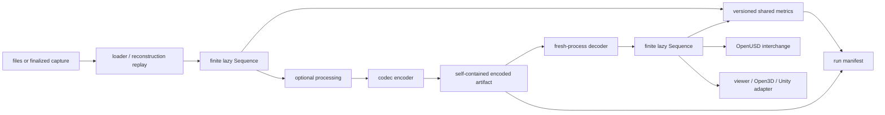
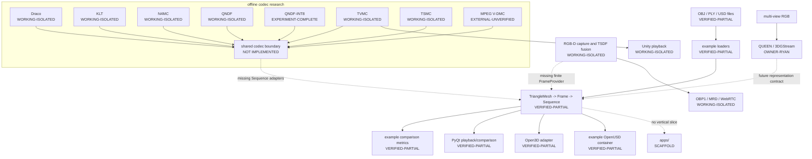
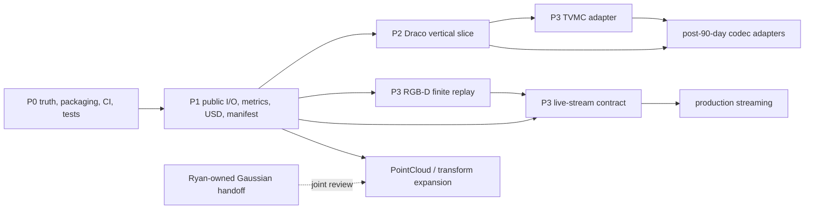

# System architecture

Open4D's long-term value is not any one codec. It is the ability to put unlike
loaders, reconstructions, codecs, metrics, containers, and viewers behind clear
boundaries so an experiment is reproducible and comparable.

## The intended offline architecture



The important contracts are:

- `TriangleMesh` is spatial data, not a file, frame, codec, or stream.
- `Frame` adds source identity, time, and lightweight metadata.
- `FrameProvider` owns storage and decoding.
- `Sequence` gives finite, lazy, random access and topology declarations.
- a codec owns encoded artifacts and configuration, and produces a provider;
- metrics state their algorithm/version and compare through shared values;
- a run manifest records inputs, configuration, artifacts, environment, timing,
  and results.

The existing geometry/frame/provider/sequence separation and canonical NumPy
dtypes should be preserved.

## The actual v0.2-dev architecture

The public core exists, but most useful I/O and measurement code is in examples,
and every research pipeline uses its own file/tensor/Open3D conventions:



An arrow here means data can conceptually flow, not that a supported Open4D API
connects the boxes. Dashed arrows name missing integration boundaries.

## Reconstruction, compression, storage, and transport

These stages must remain separable:

| Stage | Question it answers | Typical input | Typical output in this repository |
| --- | --- | --- | --- |
| Capture | What did the sensor observe and when? | RGB, depth, calibration | OBP1 paired RGB-D packets or saved captures |
| Reconstruction | What 3D representation explains those observations? | calibrated images/depth | point cloud, TSDF-derived mesh, or Gaussians |
| Processing | How should geometry be normalized/tracked/remeshed? | meshes/volumes | aligned mesh, reference mesh, displacement field |
| Compression | Which information can be stored approximately with fewer bits? | mesh/TSDF/Gaussians | Draco bytes, coefficients, latent/model, deltas |
| Container | How are frames and metadata packaged on disk? | frames and streams | planned OpenUSD schema v1 |
| Transport | How do bounded messages move between peers? | encoded/raw payloads | OBP1, MRD1/2/3 experiments |
| Playback | How does a consumer schedule and display results? | decoded frames | PyQt/OpenGL, Open3D WebRTC, Unity |
| Evaluation | What size, quality, speed, and latency were achieved? | reference/output/manifests | JSON, CSV, tables, rendered comparisons |

Keeping these separate lets a new transport carry an old codec, or a new codec
reuse the same metrics, without copying an entire application.

## Finite sequences versus live streams

`Sequence` is intentionally finite and random-access. A live camera stream has
unknown length, backpressure, disconnects, frame replacement, clock domains,
and closure. Pretending it is a `Sequence` makes those semantics implicit.

The future live boundary should look conceptually like:

```text
LiveSource[Geometry]
  -> StreamSample(session, epoch, frame_id, presentation_time,
                  clock, dependency, payload/content type, statistics)
  -> bounded consumer queues
  -> recording or frozen snapshot
  -> finite FrameProvider
  -> Sequence
```

The contract must name buffer/drop policy, keyframe dependencies, closure and
errors, and conversion to a finalized recording. P3 specifies and tests this
contract; it does not promise production networking.

## Data ownership

Use this placement rule:

- stable NumPy value and finite sequence semantics belong in `open4d.core`;
- supported general loaders/containers belong in future `open4d.io`;
- supported general measurements belong in future `open4d.metrics`;
- heavy or restrictive research implementations remain isolated;
- external ecosystem conversion belongs in `integrations/`;
- end-to-end demonstrations belong in `apps/`;
- runnable teaching and inspection tools belong in `examples/`.

Do not put codec bitstreams in `TriangleMesh.metadata`, make Open3D own sequence
time, model a TSDF as fake vertices, or model Gaussians as zero-face meshes.

## Roadmap dependency graph



The order is intentional. A codec adapter built before public I/O, artifact,
metric, and manifest contracts will invent private versions that must be
replaced later.
