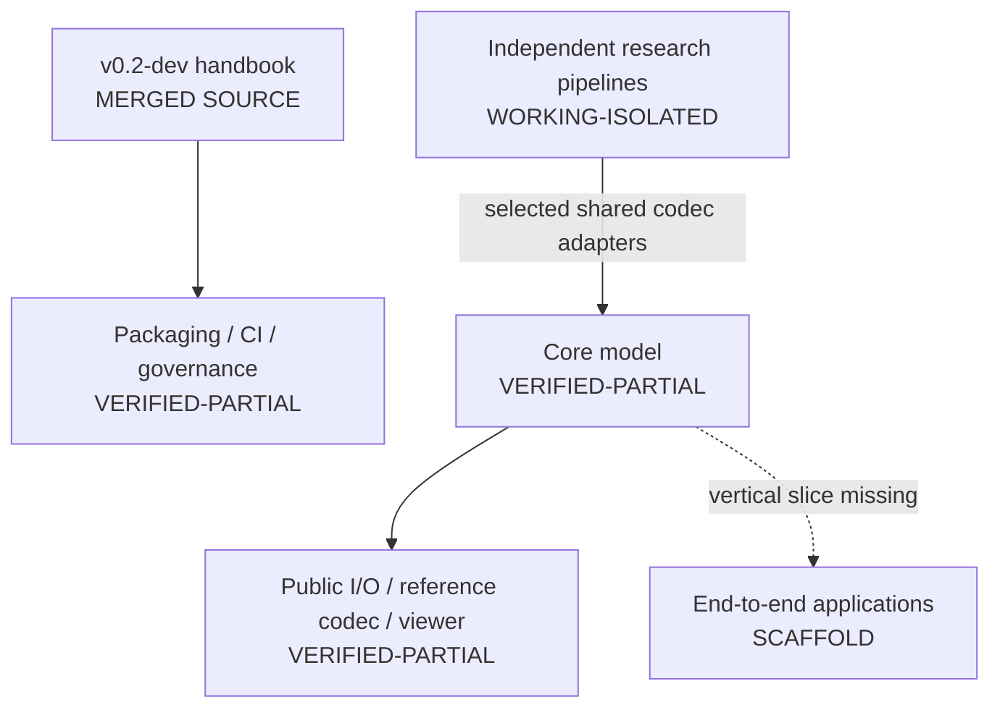

# Current implementation status

The detailed [component register](status.md) is the immutable audit of commit
`96b8c7b` on 2026-08-13. This page records the live gap between that baseline
and the [90-day roadmap](roadmap.md). It must be updated when roadmap work is
merged; planned or locally reverted work must not be reported as implemented.

Last reconciled with `94ae714` (`origin/main`) on 2026-08-27. Test counts below
retain their own earlier snapshot date.

## Current platform graph

## P0 release-safety status

| Work item | Current state | Next evidence required |
| --- | --- | --- |
| Versioned handbook | Source and root README link are merged; local links are validated | Decide whether to publish and maintain a separate Wiki copy |
| Explicit lightweight package allowlist | Implemented for exactly eight packages; namespace discovery removed | Keep the provenance and archive assertions required in CI |
| Exact distribution assertion | Wheel and source archive inventories pass locally and are required by CI | Record any release-boundary change in the ledger and archive assertions |
| Third-party/provenance ledger | Root ledger covers the high-risk research, data, model, binary, paper, and submodule areas | Resolve each entry with immutable provenance and reviewed distribution terms |
| License/distribution gate | Supported release workflow fails while `BLOCK` entries remain | Resolve TVMC, QNDF, copied-upstream, binary, dataset, checkpoint, and paper scope |
| Continuous integration | Blacksmith-backed GitHub Actions workflow on `main` contains Python/Open3D matrices, research-codec CPU contracts, packaging smoke tests, links, syntax, provenance, and release checks | Keep required jobs green and record any runner-specific exceptions |
| CodeRabbit | Repository features disabled in version-controlled configuration | Remove this repository from the CodeRabbit GitHub App installation to revoke access |
| Protected merge policy | No repository ruleset recorded at the audit point | Require the verified CI checks after their exact GitHub check names exist |

## Verified baseline that remains

- NumPy-backed `TriangleMesh`, `Frame`, finite lazy `Sequence`, and their
  existing tested behaviors.
- Public mesh sequence loading, a lossless modular reference codec, the Qt
  sequence viewer, example comparison tools, and Open3D conversion within the
  scopes recorded in the component register.
- Independent codec and reconstruction research trees, with public adapters
  for KLT, N4MC, QNDF/QNDF-int8, temporal mesh experiments, and V-Mesh; they
  do not yet form a complete end-to-end application.
- The restored `gs_tools` directory holds the shared Gaussian environment,
  rasterizers, GLM, simple-knn, and SIBR viewer used by QUEEN and 3DGStream. It
  remains in Ryan's ownership lane and outside the lightweight distribution.
- Both the pinned MPEG V-DMC reference tree and the `faster_vdmc` fork are
  registered as submodules; their public adapters require configured native
  executables and neither clears the release-provenance block.
- Checksum-based artifact-fetching policy and the component-specific mechanics
  explicitly identified in the handbook as worth preserving.

## Local verification snapshot

Latest recorded test snapshot taken 2026-08-25 on macOS:

- A clean Python 3.13 environment installed with `uv pip install -e '.[dev]'`
  and run with `python -m pytest -q` reports 233 passed and 26 explicit
  optional-dependency, research-host, or GUI skips; nothing is deselected.
- The dependency-complete Python 3.12 codec environment run with
  `.venv/bin/python -m pytest -q` reports 286 passed and 10 research-host/GUI
  skips; nothing is deselected.
- The focused manifest and Draco declaration regressions run with
  `.venv/bin/python -m pytest -q open4d/codec/tests/test_draco.py
  open4d/io/tests/test_sequence_io.py open4d/codec/tests/test_codec.py`.
- `scripts/check_provenance.py`, `scripts/check_markdown_links.py`, Python
  compilation, distribution inventory checks, and `git diff --check` pass.

## Not currently implemented

The working tree contains the first mesh-loading slice of `open4d.io`,
NumPy/ZIP reference codecs, public KLT, N4MC, QNDF/QNDF-int8, temporal-mesh,
Draco, and V-Mesh adapters, and the public Qt visualizer. It does **not** contain
`open4d.metrics`, the schema-v1 USD API, a complete Draco reference application,
TVMC/TSMC shared adapters, an RGB-D finite replay adapter, or a live-stream
contract implementation. These remain roadmap items.

Blacksmith is an automation surface, not evidence by itself. Its workflow
results must prove the tests, packaging boundary, provenance containment, and
release block for each protected change.

## Immediate order of work

1. Resolve the provenance ledger's `BLOCK` entries; do not publish meanwhile.
2. Record and require the stable CI check names in protected-merge rules.
3. Remove this repository from the CodeRabbit GitHub App installation.
4. Decide whether the repository handbook or a separately maintained Wiki is
   the public source of truth.
5. Finish the public metrics and USD contracts, then build the first complete
   reference application in `apps/`.
