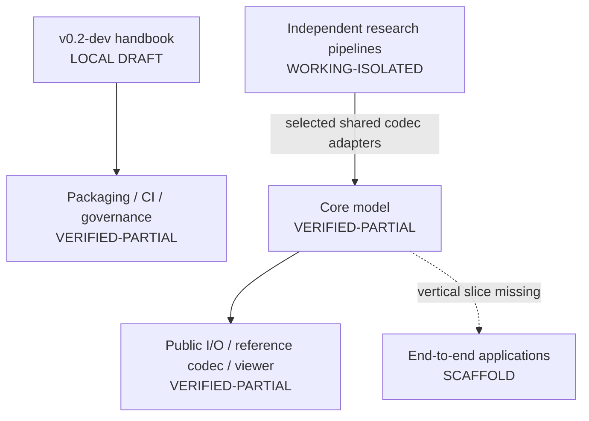

# Current implementation status

The detailed [component register](status.md) is the immutable audit of commit
`96b8c7b` on 2026-08-13. This page records the live gap between that baseline
and the [90-day roadmap](roadmap.md). It must be updated when roadmap work is
merged; planned or locally reverted work must not be reported as implemented.

## Current platform graph

## P0 release-safety status

| Work item | Current state | Next evidence required |
| --- | --- | --- |
| Versioned handbook | Source and root README link prepared; Wiki export committed locally with validated links | Initialize the enabled GitHub Wiki, push the prepared export, review, and merge this branch |
| Explicit lightweight package allowlist | Implemented for exactly seven packages; namespace discovery removed | Keep the provenance and archive assertions required in CI |
| Exact distribution assertion | Wheel and source archive inventories pass locally | Confirm the packaging job on Blacksmith for this pull request |
| Third-party/provenance ledger | Root ledger covers the high-risk research, data, model, binary, paper, and submodule areas | Resolve each entry with immutable provenance and reviewed distribution terms |
| License/distribution gate | Supported release workflow fails while `BLOCK` entries remain | Resolve TVMC, QNDF, copied-upstream, binary, dataset, checkpoint, and paper scope |
| Continuous integration | Blacksmith-backed GitHub Actions workflow, Python/Open3D matrices, packaging smoke test, links, syntax, provenance, and release checks prepared | Verify all GitHub checks on this pull request |
| CodeRabbit | Repository features disabled in version-controlled configuration | Remove this repository from the CodeRabbit GitHub App installation to revoke access |
| Protected merge policy | No repository ruleset recorded at the audit point | Require the verified CI checks after their exact GitHub check names exist |

## Verified baseline that remains

- NumPy-backed `TriangleMesh`, `Frame`, finite lazy `Sequence`, and their
  existing tested behaviors.
- Public mesh sequence loading, a lossless modular reference codec, the Qt
  sequence viewer, example comparison tools, and Open3D conversion within the
  scopes recorded in the component register.
- Independent codec and reconstruction research trees, with public adapters
  for KLT, N4MC, QNDF/QNDF-int8, temporal mesh experiments, and V-Mesh; they
  do not yet form a complete end-to-end application.
- Checksum-based artifact-fetching policy and the component-specific mechanics
  explicitly identified in the handbook as worth preserving.

## Local verification snapshot

- Python 3.13: 218 runnable tests pass on macOS; three optional tests skip and
  the pre-existing empty-integer-attribute failure is deselected after baseline
  reproduction.
- Python 3.12 on the Ubuntu SSH host: 83 codec, visualization, and example tests
  pass; the dataset/display-gated integrations skip explicitly.
- The macOS player environment passes 81 tests, including a native OpenGL
  load -> encode -> fresh decode -> two-frame GIF render of the Rafa sequence.
- Python 3.10: 78 core tests pass; the full local visualization tier is blocked
  by a SciPy macOS binary that the current linker rejects. The Linux
  Blacksmith matrix is the authoritative remaining 3.10 check.
- Open3D 0.19 on Python 3.12: 5 adapter tests pass.
- Exact wheel and source-distribution inventories pass, followed by a clean
  wheel installation and dependency check.
- Markdown links, Python compilation, shell syntax, provenance containment,
  release-block presence, and whitespace checks pass locally.

## Not currently implemented

The working tree contains the first mesh-loading slice of `open4d.io`,
NumPy/ZIP reference codecs, public KLT, N4MC, QNDF/QNDF-int8, temporal-mesh,
Draco, and V-Mesh adapters, and the public Qt visualizer. It does **not** contain
`open4d.metrics`, the schema-v1 USD API, a complete Draco reference application,
TVMC/TSMC shared adapters, an RGB-D finite replay adapter, or a live-stream
contract implementation. These remain roadmap items.

Blacksmith is an automation surface, not evidence by itself. Its pull-request
results must still prove the tests, packaging boundary, provenance containment,
and release block implemented in this branch.

## Immediate order of work

1. Initialize and publish the enabled Wiki, then review and merge the handbook.
2. Remove this repository from the CodeRabbit GitHub App installation.
3. Verify the complete Blacksmith matrix on the pull request.
4. Configure protected-merge checks using the stable check names from that run.
5. Resolve the provenance ledger's `BLOCK` entries; do not publish meanwhile.
6. Begin P1 only after P0 acceptance criteria are green.
