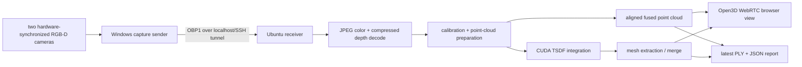

# Reconstruction and streaming

Reconstruction creates a 3D representation from sensor observations. Streaming
moves observations or encoded representations between machines. The current
repository has both jobs, but not one unified live-geometry architecture.

## RGB-D in plain language

An RGB-D camera produces a color image and a depth image. Camera calibration
maps a depth pixel to a 3D ray and maps depth/color sensors into a common camera
coordinate system. Multi-camera calibration maps camera 2 into camera 1's
coordinates. If timing or calibration is wrong, two otherwise correct point
clouds appear doubled or torn.

The maintained Python two-camera path is:

The point cloud updates for processed camera pairs. Mesh rebuilding happens
periodically over a bounded recent window; it is not a continuous compressed
mesh stream. The default independent-merge mode reconstructs each camera in its
own TSDF and transforms/concatenates or welds meshes. Shared-TSDF integrates
both cameras in one volume. The full paper-style overlap removal/stitching is
not implemented.

The receiver uses bounded latest-result queues (`maxsize=1`) and bounded history
deques, replacing stale work rather than allowing unbounded latency/memory.
Preserve that behavior.

The C++ tree is the original native lane: K4A-compatible live/recorded capture,
CUDA texture mapping/reconstruction, PLY/OBJ/texture/Draco output, metrics, and
mesh transport. It has a CUDA texture-mapping test but was not built in this
audit.

## Calibration and metadata

A reproducible captured pair needs more than color/depth bytes. Finalized replay
should preserve:

- pair number and original source frame identifiers;
- both device timestamps and sender timestamp;
- synchronization error and hardware-sync flags;
- sender/receiver/drop counters at each queue;
- factory intrinsics/extrinsics and camera-to-reference transform;
- units and coordinate-frame convention;
- reconstruction backend, parameters, fusion/merge modes, and timings.

The current live classes carry much of this across protocol structures and JSON
reports, but completed meshes are Open3D values rather than
`Frame(TriangleMesh)`, and there is no finite provider over a recording.

P3 should add a tiny camera-free replay, convert completed mesh results to
changing-topology frames, and reopen a finalized recording as a finite
`Sequence`. That is a replay/recording boundary, not a reason to make `Sequence`
infinite.

## Current network protocols

| Protocol | Direction/purpose | Payload and metadata | Safety already present | Status/direction |
| --- | --- | --- | --- | --- |
| OBP1 | capture sender to RGB-D fusion receiver | one synchronized pair; color/depth descriptors, serials, formats, dimensions, raw/compressed lengths, pair/timestamps/sync/drop fields | version/magic, header and payload CRCs, maximum counts/sizes, exact receive, ACK with CRC and pair number | preserve; add golden/reconnect/sequence tests |
| MRD1 | native reconstruction to one-shot client | raw positions, normals, indices, per-corner UVs, RGB8 texture | fixed header and payload-size validation in reference receiver | retain as one-shot fixture |
| MRD2 | native reconstruction to one-shot client | Draco geometry and raw RGB8 texture | fixed header and texture-size checks | retain as one-shot fixture |
| MRD3 | native reconstruction continuous output | per-frame Draco geometry + JPEG image, frame ID, split 64-bit timestamp, counts/drop fields | magic/version/codec checks in receiver | experimental; not the future general envelope |
| raw Unity path | native direct sender/consumer experiment | implementation-specific mesh buffers | no shared contract | deprecate rather than expand |

OBP1 source bounds include at most 8 payloads, a 4 KiB header, 32 MiB total
compressed payload, 12 MiB per compressed payload, and 16 MiB declared raw
payload. A successful receive validates both the header and each payload before
returning a frame. These are meaningful protocol invariants and should get
binary golden tests rather than a rewrite.

Required OBP1 tests include fragmented reads, header/payload CRC failures,
oversize declarations, descriptor-total mismatch, malformed/too-long serials,
ACK mismatch/corruption, clean shutdown, timeout, reconnect, gaps, duplicates,
timestamp preservation, bounded queue replacement, and bounded memory.

## Future live-source contract

The P3 deliverable is a specification plus deterministic replay tests, not a
production Internet transport. A future `LiveSource[T]` and `StreamSample[T]`
must define at least:

| Field/behavior | Why it is required |
| --- | --- |
| session ID and epoch | distinguish a reconnect/restart from delayed old data |
| unsigned 64-bit frame ID | stable ordering beyond short demonstrations |
| presentation timestamp and clock domain | schedule playback and calculate valid latency |
| content/representation type | distinguish mesh, points, volume, Gaussian, or codec payload |
| keyframe/base dependency | know whether a delta is decodable after loss/reconnect |
| buffer and drop policy | make latency/memory behavior deterministic |
| source/queue/consumer statistics | attribute drops and throughput correctly |
| end, close, cancellation, and error semantics | finalize recordings and release resources |
| recording/freeze operation | turn a bounded session into a finite provider/`Sequence` |

Do not collapse performance into one “bitrate” or “latency.” Record codec
payload bitrate, container/wire bitrate, useful goodput, capture-to-decode,
capture-to-present, startup, and drop counts at capture, sender, network,
receiver, preparation, reconstruction, decode, and presentation separately.

For the 90-day horizon, localhost listeners plus SSH tunneling are the supported
remote-security model. Authenticated encryption, Internet exposure,
multi-client delivery, rate adaptation, jitter buffering, and reconnect-to-
keyframe behavior are post-contract work.

## Unity

The Unity integration is a specialized TVMC playback stack: a C++ decoder uses
reference geometry, anchor/basis/trajectory data and windowed subsequences; C#
updates Unity meshes for desktop or Quest. Prebuilt macOS and Android libraries,
an encoded example zip, helper conversion scripts, and C++ source are tracked.

It is useful isolated code, not a generic Open4D player. Before extending it,
the project must choose one of two dispositions:

1. repair and support it by reconciling source/prebuilt C ABI, C# class/file
   naming, buffer eviction, build matrix, and a tiny artifact test; or
2. clearly label it legacy/prebuilt-only.

TSMC/generic playback remains separate future work. Do not route the new live
contract through the old raw transport by default.

## Gaussian splats: Ryan's ownership boundary

The audited tree contains full sibling directories
`open4d/reconstruction/queen/` and `open4d/reconstruction/3dgstream/`.
`open4d/reconstruction/gs_tools/` is only a placeholder README. Documentation
that says QUEEN and 3DGStream live under `gs_tools` is stale; the deleted design
must not be recreated without Ryan's agreement.

### QUEEN

QUEEN trains dynamic 3D Gaussians from calibrated multi-view images. Its
research implementation uses a dense/initial frame plus quickly trained,
quantized residual-frame data and specialized CUDA rasterizers. It reports
free-viewpoint image quality, storage, training time, and render speed. The
vendored tree includes NVIDIA/non-commercial and other third-party terms, CUDA
extensions, MiDaS, Docker/environment setup, rendering, and evaluation scripts.

### 3DGStream

3DGStream starts from a high-quality initial 3D Gaussian model. For later
frames, a neural transformation cache updates existing Gaussians and additional
Gaussians model newly visible content. It requires calibrated multi-view frame
directories, COLMAP data, CUDA/tiny-cuda-nn, preprocessing/warm-up, and a
specialized renderer/viewer. The tracked test assets are large and should move
only through a provenance-preserving artifact plan.

### What Ryan owns

Ryan owns:

- QUEEN and 3DGStream algorithms and training/quantization behavior;
- CUDA rasterizers and GPU environments;
- Gaussian representation semantics and correctness/performance;
- upstream pinning or vendoring decisions.

General platform contributors must not refactor these directories or invent a
Gaussian core type. The shared platform may request this handoff, reviewed by
Ryan:

- exact upstream revisions and local patch list;
- third-party license/provenance inventory;
- one reproducible GPU command and a licensed two-frame smoke artifact;
- input manifest for images, intrinsics, extrinsics, timestamps, splits, and
  COLMAP data;
- output manifest for initial state, per-frame deltas, coordinate system,
  units, time, sizes, and renderer requirements;
- renderer-ready buffer or artifact contract;
- self-contained keyframe semantics and explicit delta dependencies.

Until that handoff, both methods remain `OWNER-RYAN`, excluded from the
lightweight wheel, and unverified by shared-platform acceptance tests.
