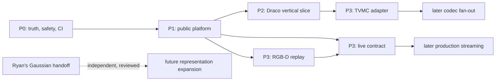

# Dependency-ordered roadmap and TODO list

Checklist status was reconciled with the repository on 2026-08-27. A checked
box means the named repository change exists; it does not waive the release
block or make a research pipeline complete.

This list is ordered by dependency and risk, not by how exciting the demo looks.
P0 prevents unsafe releases and false status claims; P1 creates reusable
contracts; P2 proves them on a CPU codec; P3 applies them to temporal capture
and compression.

## Priority graph



## P0 — days 1–14: truth, safety, and enforceable quality

### Critical release safety

- [x] Publish this versioned `v0.2-dev` handbook and link it from the root
  README.
- [x] Replace namespace auto-discovery with an explicit lightweight package
  allowlist.
- [x] Build a clean wheel and assert its exact file list; ensure no research
  codec, Gaussian, dataset, paper, or Unity binary ships accidentally.
- [x] Create a root third-party/provenance ledger covering code, submodules,
  models, datasets, binaries, papers, copied helpers, and licenses.
- [ ] Resolve TVMC, QNDF, copied-upstream, binary, and dataset distribution
  scope. Block releases until this gate passes.
- [x] Record Ryan's ownership of QUEEN/3DGStream in contribution/ownership
  guidance and exclude those paths from unrelated refactors.

### CI and tests

- [x] Add Python 3.10–3.13 core build/install/import/test jobs.
- [x] Add Python 3.10–3.12 Open3D jobs.
- [x] Add clean packaging smoke tests and exact wheel-content checks.
- [x] Add Python syntax, shell syntax, Markdown-link, provenance, and license
  validation.
- [x] Configure root pytest markers: `cpu`, `open3d`, `torch`, `gpu`,
  `hardware`, `slow`, and `player`.
- [x] Keep research experiment scripts out of default test collection without
  deleting their documented workflows.
- [x] Restore comprehensive Frame/provider/Sequence/view tests: empty,
  timestamps, slices, topology, metadata, cleanup, laziness, failures.
- [x] Reject integer named attributes outside the canonical `int32` range.

### P0 acceptance

- A clean supported environment installs and runs one documented command.
- The wheel contains only intentional MIT-compatible lightweight files.
- Every green handbook claim maps to an automated command.
- Default tests never open local datasets, absolute user paths, GPUs, or
  hardware.
- The repository/status map agrees with the actual tree.

## P1 — days 15–35: establish the public platform

### Public interfaces

- [x] Add `open4d.io.open_sequence(path, fps=None) -> Sequence` for local mesh
  files and frame folders.
- [ ] Add `open4d.io.write_usd_container(path, frames, ...) -> Path`.
- [ ] Add `open4d.metrics.compare_meshes(...)`.
- [ ] Add `open4d.metrics.compare_sequences(..., allow_truncate=False)`.
- [x] Keep the base NumPy-only and lazily load SciPy/OpenUSD/Open3D/viewers.
- [ ] Convert examples into thin clients of the public functions.

### Correctness and interchange

- [ ] Require equal sequence lengths by default; make truncation explicit.
- [ ] Pool sequence error/PSNR using one documented peak and retain source
  frame indices.
- [ ] Publish metric identifier `open4d.vertex-nearest/v1` and clearly label
  vertex-set, non-area-weighted limitations.
- [ ] Ratify OpenUSD schema v1 as primary offline interchange.
- [ ] Round-trip positions, triangles, colors, normals, UVs, named attributes,
  timestamps, frame indices, sequence metadata, and topology declarations.
- [ ] Support Y-up/Z-up, reject X-up, reject mixed Mesh/Points, and handle empty
  extents explicitly.
- [ ] Add a generated or redistributable two-to-three-frame fixture.
- [ ] Implement and validate `open4d.run-manifest/v1`.

### P1 acceptance

- Loader construction remains lazy and lifecycle cleanup is tested.
- Every supported USD field round-trips; unsupported data fails explicitly.
- The base wheel remains lightweight and contains no research codec.
- One tiny fixture and manifest schema are reused by later adapters.

## P2 — days 36–60: first complete Draco vertical slice

- [ ] Deterministically initialize/build the pinned Draco implementation.
- [ ] Create `apps/` reference workflow:

  ```text
  fixture -> open_sequence -> Draco encode -> retained artifact only
          -> fresh-process decode -> lazy decoded Sequence
          -> shared metrics -> manifest -> optional viewer
  ```

- [ ] Check subprocess return codes and surface command/stderr/actionable setup
  errors.
- [ ] Store every frame's source index, timestamp, codec configuration, hash,
  and actual encoded bytes.
- [ ] Decode after source and intermediates are inaccessible.
- [ ] Separate codec payload, filesystem/container, and future wire bytes.
- [ ] Add golden metric/size bounds and keep codec-local metrics alongside the
  cross-codec baseline.
- [ ] Run the same CPU vertical slice in CI with one documented command.

### P2 acceptance

- Recursive clone plus one command runs the CPU workflow.
- Fresh decode requires only the declared artifact.
- The result includes decoded sequence, comparison report, and valid manifest.
- This becomes the first component eligible for `COMPLETE`.

## P3 — days 61–90: temporal adapter, finite replay, live contract

### TVMC temporal adapter

- [ ] Consume the public directory `Sequence` without breaking current CLI,
  files, cached intermediates, dry-run, or resume behavior.
- [ ] Serialize every value needed to restore displacement-to-vertex
  correspondence.
- [ ] Prove decoding without original encoder-side displacement values.
- [ ] Expose decoded frames through a finite lazy provider.
- [ ] Declare changing/fixed topology, constant vertex count, and correspondence
  at the stages where each statement is true.

### RGB-D finite replay

- [ ] Preserve pair/device/sender time, sync error, drop counters, calibration,
  units, coordinate frame, backend, configuration, and reconstruction timing.
- [ ] Add a tiny camera-free synthetic or licensed recorded fixture.
- [ ] Convert mesh results to `Frame(TriangleMesh)` with changing topology.
- [ ] Finalize/reopen a recording as a finite `Sequence` and write USD.
- [ ] Add OBP1 golden tests for fragmentation, CRCs, bounds, malformed serials,
  ACKs, gaps, duplicates, shutdown, reconnect, timestamps, and bounded queues.

### Live-source architecture contract

- [ ] Keep finite `Sequence` unchanged.
- [ ] Specify future `LiveSource[T]`/`StreamSample[T]`: session, epoch, 64-bit
  frame ID, clock/presentation time, dependency, type, buffer/drop policy,
  statistics, cancellation/error/closure.
- [ ] Define recording and frozen-snapshot conversion to finite providers.
- [ ] Specify separate payload/wire/goodput/latency/startup/drop measurements.
- [ ] Keep localhost plus SSH tunnel as the supported remote security model.
- [ ] Mark MRD1/2 one-shot fixtures, MRD3 experimental, and raw Unity transport
  deprecated.

### P3 acceptance

- TVMC independently decodes to a `Sequence`.
- Camera-free replay deterministically produces mesh frames and USD.
- OBP1 tests prove bounds, reconnect, timing preservation, and bounded memory.
- Live-contract replay tests pass without weakening finite sequence semantics.

## Post-90-day backlog

1. **Finish self-contained codec artifacts**: KLT basis/mean and decoder; N4MC
   real entropy/model accounting/SSIM contract; QNDF full decode bundle; TSMC
   entropy side information; initialized V-DMC wrapper and macOS build work.
2. **Fan out adapters**: reuse TVMC directory/reference machinery in TSMC;
   expose N4MC/KLT reconstructed meshes before defining volumes; expose QNDF
   frame/sequence-run outputs; require fresh-decode golden tests everywhere.
3. **Decide Unity support**: repair ABI/naming/eviction/build/tests or label
   legacy/prebuilt-only; keep generic/TSMC playback accurately scoped.
4. **Externalize historical artifacts**: N4MC outputs, TSMC datasets,
   3DGStream assets, and Unity archive, preserving license/provenance/checksums;
   implement the reserved dataset registry.
5. **Expand representations from evidence**: PointCloud plus transforms/units
   first; Volume/TSDF after real adapter needs; Gaussian only through a
   Ryan-reviewed contract. Never force these into `TriangleMesh`.
6. **Build production streaming after the contract**: independent Draco frames,
   then TVMC reference chunks; authenticated encryption, multi-client queues,
   jitter buffering, reconnect-to-keyframe, Unity/browser clients, and rate
   adaptation.

## Parallel work lanes

Within each priority, independent lanes can run concurrently:

- release/package/provenance;
- core tests and test collection;
- public I/O/USD;
- public metrics/manifests;
- Draco fixture/app after the P1 boundary is stable;
- RGB-D protocol tests/replay fixture;
- Ryan-owned Gaussian handoff, independently reviewed.

Do not parallelize by letting each codec invent its own loader, metric, manifest,
or live envelope. That creates fast local progress and slow project integration.
