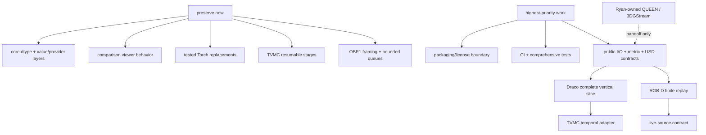

# Component status and evidence

## Audit basis

| Field | Value |
| --- | --- |
| Audited commit | `96b8c7bbb48e2a8d231684639cfc57799ca6666d` (`origin/main` baseline) |
| Audit date | 2026-08-13 |
| Recorded test environment | Python 3.12 for the captured shared-platform runs |
| Recorded automated evidence | 106 core/visualization tests passed; 5 Open3D adapter tests passed |
| Submodule state inspected | all six root submodule paths uninitialized (`git submodule status` prefixed each with `-`) |
| Checkout size observed | approximately 1.2 GB, including tracked historical research data/results/binaries |
| Package state | lightweight install/build works, but namespace discovery and license scope are not release-safe |

The recorded shared commands were:

```bash
python -m pip install -e .
python -m pytest -q open4d/core/tests examples/visualization/tests
# 106 passed on Python 3.12

python -m pytest -q integrations/open3d/tests
# 5 passed on Python 3.12 with Open3D installed
```

The codec, GPU, camera, C++, .NET, Unity, and V-DMC statuses below are based on
source/configuration/artifact inspection unless explicitly stated. A paper,
README, tracked output, or runnable-looking script is not recorded end-to-end
verification.

## Status rubric

> **Complete means:** setup is reproducible, a licensed sample runs end to end,
> automated tests pass, outputs are documented, and the component works through
> its supported Open4D interface.

| Status | Meaning |
| --- | --- |
| `COMPLETE` | Meets every part of the strict definition above. |
| `VERIFIED-PARTIAL` | Tested behavior works, but the subsystem or shared integration is incomplete. |
| `WORKING-ISOLATED` | Useful standalone research pipeline exists without shared integration. |
| `EXPERIMENT-COMPLETE` | A narrow research question was completed, not a general codec/system. |
| `EXTERNAL-UNVERIFIED` | Pinned upstream code is not currently validated in Open4D. |
| `SCAFFOLD` | Placeholder, policy, or design exists without an implemented vertical slice. |
| `OWNER-RYAN` | Gaussian-splat work owned by Ryan; shared work stops at agreed interfaces. |

No major end-to-end Open4D pipeline is `COMPLETE` in this snapshot.

## What to preserve and what to build

| Section | Status | Preserve | Needs work |
| --- | --- | --- | --- |
| Core model | `VERIFIED-PARTIAL` | canonical dtypes and geometry/frame/provider/sequence separation | comprehensive lifecycle/topology/time tests; safe integer attributes |
| Example I/O/USD/metrics/viewers | `VERIFIED-PARTIAL` | laziness, format registry, symmetric comparison, synchronized viewer | promote stable APIs; schema fidelity; strict lengths; pooled reports |
| Torch/Open3D adapters | `VERIFIED-PARTIAL` | dependency isolation and existing conversion semantics | packaging/support tiers and complete optional tests |
| Codecs | mostly `WORKING-ISOLATED` | scientific pipelines and codec-local evaluation | self-contained artifacts, providers, shared metrics/manifests |
| RGB-D/networking | `WORKING-ISOLATED` | OBP1 framing/bounds/CRCs/ACK and bounded latest queues | golden tests, finite replay/provider, live contract |
| Gaussian splats | `OWNER-RYAN` | imported research implementations and ownership | Ryan-reviewed reproducible handoff only |
| Unity | `WORKING-ISOLATED` | specialized TVMC decoder/playback | support-or-legacy decision and tiny tests |
| Apps | `SCAFFOLD` | intended location | first Draco vertical slice |
| Packaging/licensing/CI | `SCAFFOLD` to `VERIFIED-PARTIAL` | NumPy-only intent and checksum policy | allowlist, provenance/license gate, CI matrix |



## Detailed register: shared platform

### Core geometry, frame, provider, and sequence — `VERIFIED-PARTIAL`

- **Audit:** `96b8c7b`, 2026-08-13.
- **Research/upstream capability:** NumPy-backed mesh values and a finite lazy
  temporal abstraction with topology declarations.
- **Open4D integration:** this is the current public root-package API and the
  intended boundary for loaders, decoded outputs, metrics, and adapters.
- **Verification:** included in the recorded 106-test Python 3.12
  core/visualization run; source inspection shows most historical coverage is
  concentrated in dtype tests at this revision.
- **Input/output:** NumPy-compatible arrays/providers -> `TriangleMesh`,
  `Frame`, `Sequence`, and lazy views.
- **Owner lane:** shared platform.
- **Known blockers:** incomplete Frame/provider/Sequence lifecycle, failure,
  timestamp, topology, empty, and view tests; generic integer attributes can
  narrow to `int32` without an explicit range guard.
- **Smallest useful next contribution:** add the missing behavior tests and one
  failing large-integer-attribute test before changing implementation.

### Example mesh/folder loaders — `VERIFIED-PARTIAL`

- **Audit:** `96b8c7b`, 2026-08-13.
- **Research/upstream capability:** lazy folders/single files for OBJ, PLY, USD,
  and optional trimesh formats.
- **Open4D integration:** local mesh files and folders are public through
  `open4d.io`; USD remains example-local.
- **Verification:** public I/O has focused CPU tests; USD retains example tests.
- **Input/output:** mesh directory or file -> lazy `Sequence[Frame[TriangleMesh]]`.
- **Owner lane:** shared platform I/O.
- **Known blockers:** filename-last-number ordering remains a convention;
  limited OBJ/PLY attributes and the point-cloud placeholder remain.
- **Smallest useful next contribution:** promote the USD backend with explicit
  schema, point-cloud, and lossy-write decisions.

### Example OpenUSD container — `VERIFIED-PARTIAL`

- **Audit:** `96b8c7b`, 2026-08-13.
- **Research/upstream capability:** reads/writes time-sampled mesh or points
  stages, topology keyframes, colors, timing streams, and layer metadata.
- **Open4D integration:** example provider returns `Sequence`; writer consumes
  frames, but no ratified public schema/API exists.
- **Verification:** USD behavior is represented in visualization tests; exact
  supported-field round-trip is not complete.
- **Input/output:** frames or USD -> `.usd/.usda/.usdc/.usdz` or `Sequence`.
- **Owner lane:** shared platform I/O/interchange.
- **Known blockers:** normals/UVs/attributes/metadata fidelity, original index
  restoration, mixed Mesh/Points handling, empty extent, and X-up validation.
- **Smallest useful next contribution:** write schema-v1 golden tests for every
  supported field plus explicit failure tests for mixed kinds/X-up.

### Example comparison metrics — `VERIFIED-PARTIAL`

- **Audit:** `96b8c7b`, 2026-08-13.
- **Research/upstream capability:** bidirectional nearest-vertex point and plane
  distances, RMS, maximum/Hausdorff label, PSNR, error colors, CSV summaries.
- **Open4D integration:** consumes core sequences in example code; not yet
  `open4d.metrics` and no metric identifier/version.
- **Verification:** included in the recorded 106-test Python 3.12 run.
- **Input/output:** reference and decoded mesh sequences -> comparison objects,
  console/CSV figures, per-vertex distances/colors.
- **Owner lane:** shared metrics/evaluation.
- **Known blockers:** truncates unequal lengths, arithmetic mean frame PSNR,
  non-pooled sequence summary, lost source index, vertex-set scientific limits.
- **Smallest useful next contribution:** make unequal lengths fail by default
  and add pooled golden cases while preserving explicit truncation mode.

### PyQt visualization and comparison — `VERIFIED-PARTIAL`

- **Audit:** `96b8c7b`, 2026-08-13.
- **Research/upstream capability:** single/dual synchronized 3D playback, orbit,
  scrub/step, error shading/colorbar, and GIF rendering.
- **Open4D integration:** consumes core sequences through example loaders; not a
  base dependency and not an end-to-end codec app.
- **Verification:** non-window behavior is included in the 106-test run; GUI/GL
  behavior requires manual graphical-session acceptance.
- **Input/output:** `Sequence`/comparison -> interactive OpenGL window or GIF.
- **Owner lane:** examples/visualization.
- **Known blockers:** eager decode/measurement of displayed frames, graphical
  environment, and no automated visual acceptance matrix.
- **Smallest useful next contribution:** document and automate a tiny headless
  render smoke test where the platform supports it without changing UI behavior.

### Torch operations — `VERIFIED-PARTIAL`

- **Audit:** `96b8c7b`, 2026-08-13.
- **Research/upstream capability:** local geometry-only OBJ I/O, normals,
  sampling, Chamfer, and point-face functions replacing PyTorch3D call sites.
- **Open4D integration:** used directly by N4MC/QNDF research code; intentionally
  outside the NumPy-only core model.
- **Verification:** dedicated Torch tests exist and the replacements were tested
  during environment unification; they were not part of the captured 111-test
  core/Open3D count.
- **Input/output:** Torch tensors/OBJ -> tensors, mesh helper values, distances.
- **Owner lane:** shared optional Torch utilities plus codec owners.
- **Known blockers:** optional dependency/test-tier definition and GPU/CPU
  compatibility coverage are not enforced by CI.
- **Smallest useful next contribution:** add a marked CPU Torch CI tier that
  exercises the existing tests against the pinned shared environment.

### Open3D adapter — `VERIFIED-PARTIAL`

- **Audit:** `96b8c7b`, 2026-08-13.
- **Research/upstream capability:** converts Open4D or compatible geometry to
  Open3D triangle mesh or point cloud with colors/normals.
- **Open4D integration:** external frame adapter; correctly does not own
  sequence time/storage.
- **Verification:** 5 tests passed on Python 3.12 with Open3D.
- **Input/output:** geometry/frame-like arrays -> Open3D legacy geometry.
- **Owner lane:** external integrations.
- **Known blockers:** no Python 3.13 Open3D wheel; no UV/material conversion;
  optional-tier CI absent.
- **Smallest useful next contribution:** add the 3.10–3.12 Open3D CI job and
  verify actionable missing-extra errors.

### Applications directory — `SCAFFOLD`

- **Audit:** `96b8c7b`, 2026-08-13.
- **Research/upstream capability:** intended home for compression, XR, and
  offline end-to-end workflows.
- **Open4D integration:** none; it contains only a short README.
- **Verification:** source inspection only; no application or test exists.
- **Input/output:** not defined.
- **Owner lane:** shared applications.
- **Known blockers:** public I/O/metrics/manifest boundaries and reference app
  are missing.
- **Smallest useful next contribution:** after P1, add the tiny Draco vertical
  slice with one documented command.

## Detailed register: codecs

### Draco baseline — `WORKING-ISOLATED`

- **Audit:** `96b8c7b`, 2026-08-13.
- **Research/upstream capability:** pinned Google Draco encoder/decoder plus a
  per-frame quantization sweep and codec-local evaluation.
- **Open4D integration:** no `Sequence` input/output, artifact schema, shared
  metric, or app; binary wrapper is standalone.
- **Verification:** source/setup inspection; Draco submodule uninitialized, so
  no audit-time encode/decode run.
- **Input/output:** OBJ folder -> `.drc`, decoded OBJ, local metrics.
- **Owner lane:** codec adapter/shared first vertical slice.
- **Known blockers:** deterministic build/sample, fresh-process decoding,
  timing/identity metadata, exact accounting, manifest/provider.
- **Smallest useful next contribution:** create one licensed two-frame fixture
  and a golden encode -> fresh decode subprocess test.

### KLT — `WORKING-ISOLATED`

- **Audit:** `96b8c7b`, 2026-08-13.
- **Research/upstream capability:** learns a KLT/PCA TSDF-block basis, quantizes
  coefficients, reconstructs volume/mesh, and optionally evaluates it.
- **Open4D integration:** standalone script over TSDF files; no provider or
  complete encoded bundle.
- **Verification:** source and documented operating-point inspection; no
  end-to-end audit run.
- **Input/output:** TSDF `.npz` -> coefficient/packing intermediates and
  marching-cubes meshes.
- **Owner lane:** codec research, later adapter.
- **Known blockers:** basis/mean/shape/quantization state not packaged for an
  independent decoder; high training-block memory.
- **Smallest useful next contribution:** specify and test a bundle containing
  basis, mean, volume/block metadata, and coefficient stream.

### N4MC — `WORKING-ISOLATED`

- **Audit:** `96b8c7b`, 2026-08-13.
- **Research/upstream capability:** legacy and modular neural TSDF codec paths,
  training/validation, latent packs, marching-cubes reconstruction, basketball
  runner, and codec-local metrics.
- **Open4D integration:** no shared provider or codec contract; Torch/TSDF/local
  mesh types dominate the research path.
- **Verification:** tracked results and source/workflow inspection; no clean
  GPU end-to-end audit run.
- **Input/output:** meshes/TSDF datasets -> checkpoints, latents, reconstructed
  normalized/restored meshes, JSON status/summary.
- **Owner lane:** N4MC research, later shared adapter.
- **Known blockers:** real entropy bitstream and complete decoder artifact/rate
  accounting; SSIM contract; GPU extras; large tracked outputs.
- **Smallest useful next contribution:** define the full decoder dependency
  manifest and test a reconstructed-mesh provider without changing training.

### QNDF — `WORKING-ISOLATED`

- **Audit:** `96b8c7b`, 2026-08-13.
- **Research/upstream capability:** SSP coarse/subdivide/project preprocessing,
  neural displacement training/quantization, disconnected-component path, and
  resumable sequence runner.
- **Open4D integration:** local scripts/OBJ and Torch operations; no shared
  artifact or sequence output.
- **Verification:** source inspection; pinned libigl uninitialized and no GPU
  audit run.
- **Input/output:** OBJ -> training pair, transform, model, reconstruction,
  metrics/status.
- **Owner lane:** QNDF research, later adapter.
- **Known blockers:** GPL-3.0 distribution boundary; complete coarse mesh,
  normalization, model/configuration, entropy bundle; no fresh decoder test.
- **Smallest useful next contribution:** write a decode-dependency manifest for
  one existing run and prove which undeclared files are still required.

### QNDF-INT8 — `EXPERIMENT-COMPLETE`

- **Audit:** `96b8c7b`, 2026-08-13.
- **Research/upstream capability:** compares FP32 and dynamically quantized INT8
  QNDF linear layers with reloadable TorchScript artifacts and quality/size data.
- **Open4D integration:** intentionally isolated sibling experiment; no temporal
  or shared codec API.
- **Verification:** source/result-document inspection; the experiment includes
  reload verification, but this audit did not reproduce training.
- **Input/output:** existing SSP pair -> FP32/INT8 models, reconstructions,
  `metrics.json`.
- **Owner lane:** QNDF research experiment.
- **Known blockers:** not a full QNDF artifact and not the abandoned/commented
  Huffman format; depends on prepared sibling inputs.
- **Smallest useful next contribution:** preserve the bounded result and add
  provenance/hash fields rather than generalizing it prematurely.

### TVMC — `WORKING-ISOLATED`

- **Audit:** `96b8c7b`, 2026-08-13.
- **Research/upstream capability:** tracked reference/deformation/displacement
  temporal compression with Python, .NET, Draco, resumable stages, cached work,
  a basketball sample, and evaluation.
- **Open4D integration:** numbered files and private config/state; no shared
  input or decoded provider.
- **Verification:** source and dry-run/resume design inspection; Draco submodule
  uninitialized and no full .NET pipeline audit run.
- **Input/output:** OBJ sequence/config -> centers/transforms/reference,
  displacement/trajectory data, decoded OBJ, metrics.
- **Owner lane:** TVMC research plus first temporal adapter.
- **Known blockers:** restrictive non-commercial/no-redistribution license;
  decoder dependence on encoder-side displacement/correspondence information;
  mixed toolchains.
- **Smallest useful next contribution:** serialize the missing correspondence
  side information and prove decode with original displacement values hidden.

### TSMC — `WORKING-ISOLATED`

- **Audit:** `96b8c7b`, 2026-08-13.
- **Research/upstream capability:** SAM3 static/dynamic separation, tracking,
  reference deformation, displacement compression, scene evaluation, paper data.
- **Open4D integration:** standalone imported pipeline with duplicate TVMC-like
  conversions; no shared sequence/codec contract.
- **Verification:** source and tracked-paper-artifact inspection; Draco/SAM3
  submodules uninitialized and no Ubuntu/GPU/.NET audit run.
- **Input/output:** scene mesh/image data -> static/dynamic meshes, tracking,
  reference/displacement artifacts, reconstructed scenes/metrics.
- **Owner lane:** TSMC research, adapter after TVMC.
- **Known blockers:** entropy/decoder side information not self-contained,
  heavy toolchain/data, licensing/provenance inventory, no integrated VR player.
- **Smallest useful next contribution:** inventory the exact files required by
  current decode/evaluation and mark which are encoder originals.

### MPEG V-DMC test model — `EXTERNAL-UNVERIFIED`

- **Audit:** `96b8c7b`, 2026-08-13.
- **Research/upstream capability:** MPEG dynamic-mesh reference encoder,
  decoder, tools, metrics, and upstream tests.
- **Open4D integration:** none beyond a pinned submodule path.
- **Verification:** submodule pinned at `ecffe421...` but uninitialized; no
  source/build/runtime inspection in this checkout.
- **Input/output:** upstream test-model formats and bitstreams (not audited
  locally).
- **Owner lane:** standards/reference-codec integration.
- **Known blockers:** initialize/build requirements, macOS build issue tracked
  by the project, fixture/license/provenance, wrapper/provider/manifest.
- **Smallest useful next contribution:** initialize the exact pin and record a
  clean upstream build/test report before writing any Open4D wrapper.

## Detailed register: reconstruction, network, and integrations

### RGB-D reconstruction — `WORKING-ISOLATED`

- **Audit:** `96b8c7b`, 2026-08-13.
- **Research/upstream capability:** synchronized two-camera capture receive,
  calibrated point-cloud fusion, CUDA TSDF reconstruction/mesh merge, WebRTC
  view, saved replay, plus a native C++ path.
- **Open4D integration:** returns Open3D/live result objects and files; no core
  `FrameProvider` or finalized finite sequence.
- **Verification:** source/configuration inspection; camera, CUDA Open3D, and C++
  pipelines not reproduced in the audit.
- **Input/output:** OBP1/saved RGB-D/calibration or K4A source -> live cloud,
  PLY mesh/cloud, reports, native OBJ/texture/Draco.
- **Owner lane:** RGB-D reconstruction and shared replay boundary.
- **Known blockers:** hardware/external sender/calibration, no tiny licensed
  deterministic fixture, metadata not carried into core frames, stitching gap.
- **Smallest useful next contribution:** create a tiny synthetic/saved pair and
  convert its deterministic mesh result to a changing-topology frame.

### OBP1 and MRD transports — `WORKING-ISOLATED`

- **Audit:** `96b8c7b`, 2026-08-13.
- **Research/upstream capability:** bounded CRC/ACK paired RGB-D framing and
  three mesh/texture transport experiments with reference receivers.
- **Open4D integration:** private reconstruction protocols; no general live
  source/envelope or finite recording adapter.
- **Verification:** protocol source inspection; no captured binary/socket test
  suite at the audit baseline.
- **Input/output:** compressed capture or mesh/image payloads -> received
  protocol records and statistics.
- **Owner lane:** reconstruction networking/shared live-contract design.
- **Known blockers:** fragmentation/corruption/reconnect/gap/duplicate tests,
  session/epoch/dependency semantics, security beyond local SSH tunnel.
- **Smallest useful next contribution:** add pure local `socketpair` OBP1 golden
  tests for fragmentation, CRCs, declared bounds, ACK, and metadata.

### Unity TVMC integration — `WORKING-ISOLATED`

- **Audit:** `96b8c7b`, 2026-08-13.
- **Research/upstream capability:** C++ reference/basis/trajectory decoder,
  asynchronous windowed playback, C# Unity mesh updates, prebuilt macOS/Quest
  libraries, encoded example.
- **Open4D integration:** TVMC-specific files and ABI; no core `Sequence` or
  generic codec/live contract.
- **Verification:** source/binary/example inspection; Unity/Quest and source
  rebuild not reproduced.
- **Input/output:** zipped subsequences/reference/basis/trajectory binaries ->
  decoded Unity meshes.
- **Owner lane:** external integration, pending support decision.
- **Known blockers:** source/prebuilt ABI, class/file naming, eviction behavior,
  build matrix, restrictive TVMC boundary, no tiny automated test.
- **Smallest useful next contribution:** document and test whether the checked-in
  example decodes with each prebuilt plugin before choosing support vs legacy.

### QUEEN — `OWNER-RYAN`

- **Audit:** `96b8c7b`, 2026-08-13.
- **Research/upstream capability:** quantized dynamic 3D Gaussian training,
  compressed rendering/evaluation, and claimed streamable free-viewpoint video.
- **Open4D integration:** vendored sibling reconstruction tree; no shared
  representation, manifest, or verified adapter.
- **Verification:** source/paper README/license inspection only; no GPU run.
- **Input/output:** calibrated multi-view images/COLMAP/weights -> Gaussian
  models/deltas, compressed artifacts, renders, metrics.
- **Owner lane:** Ryan exclusively for algorithms, CUDA, environment,
  representation, upstream decisions, correctness/performance.
- **Known blockers:** exact upstream/local patch provenance, restrictive
  NVIDIA/non-commercial terms, large dependencies, smoke artifact and handoff.
- **Smallest useful next contribution:** shared team asks Ryan for the defined
  input/output manifest and two-frame smoke contract; do not edit the tree.

### 3DGStream — `OWNER-RYAN`

- **Audit:** `96b8c7b`, 2026-08-13.
- **Research/upstream capability:** initial 3D Gaussian model plus per-frame
  neural transformation cache/additional Gaussians and specialized evaluation.
- **Open4D integration:** vendored sibling reconstruction tree; no shared
  representation, manifest, or verified adapter.
- **Verification:** source/upstream README/license/tracked-fixture inspection;
  no GPU/tiny-cuda-nn run.
- **Input/output:** calibrated multi-view frames, COLMAP, initial 3DGS, NTC
  config -> per-frame transformations/new Gaussians, renders, metrics.
- **Owner lane:** Ryan under the same exclusive boundary as QUEEN.
- **Known blockers:** upstream/local patch provenance, CUDA/tiny-cuda-nn setup,
  large tracked assets, delta/keyframe/renderer contract.
- **Smallest useful next contribution:** shared team requests Ryan's exact
  upstream revision and renderer-ready artifact/dependency description.

### `gs_tools` placeholder — `SCAFFOLD`

- **Audit:** `96b8c7b`, 2026-08-13.
- **Research/upstream capability:** none in this directory; it contains only the
  heading `# gs-tools`.
- **Open4D integration:** none.
- **Verification:** direct source inspection.
- **Input/output:** none.
- **Owner lane:** documentation/shared coordination with Ryan.
- **Known blockers:** stale documents incorrectly describe this as the parent of
  QUEEN/3DGStream; previous deleted architecture is not approved.
- **Smallest useful next contribution:** correct references to the actual
  sibling directories; do not add code without Ryan's design review.

## Detailed register: project operations

### Packaging and release boundary — `VERIFIED-PARTIAL`

- **Audit:** `96b8c7b`, 2026-08-13.
- **Research/upstream capability:** setuptools build with NumPy-only base and
  optional player/USD/tools/Open3D extras.
- **Open4D integration:** root distribution currently uses namespace package
  auto-discovery (`open4d*`, `integrations*`).
- **Verification:** package build/install was recorded working; built/local tree
  inspection shows research namespace packages can be discovered beyond the
  intended lightweight core.
- **Input/output:** source tree -> wheel/editable installation.
- **Owner lane:** shared release engineering.
- **Known blockers:** exact wheel allowlist absent; root MIT metadata does not
  represent GPL, non-commercial, no-redistribution, binaries, or datasets that
  may enter distribution; no release gate.
- **Smallest useful next contribution:** replace discovery with an explicit
  allowlist and assert the exact wheel file set in a clean build test.

### Artifact policy and fetch helper — `VERIFIED-PARTIAL`

- **Audit:** `96b8c7b`, 2026-08-13.
- **Research/upstream capability:** documented ignored runtime locations,
  checksum-based fetch helper, and publication-manifest expectations.
- **Open4D integration:** policy exists, but no root registry/schema validator
  or enforcement covers historical tracked artifacts.
- **Verification:** source/policy inspection; checkout observed around 1.2 GB.
- **Input/output:** URL + SHA-256 -> verified local artifact; run metadata ->
  proposed manifest.
- **Owner lane:** shared reproducibility/release engineering.
- **Known blockers:** tracked N4MC results, TSMC datasets, 3DGStream assets,
  Unity archive, provenance/license records, external durable storage.
- **Smallest useful next contribution:** inventory the largest tracked artifacts
  with origin, license, consumer, checksum, and proposed storage location.

### Continuous integration and support tiers — `SCAFFOLD`

- **Audit:** `96b8c7b`, 2026-08-13.
- **Research/upstream capability:** package metadata names Python support and
  codec environment files name dependencies.
- **Open4D integration:** no `.github` CI workflow, root test-tier markers, or
  automated definition of done at this revision.
- **Verification:** repository/configuration inspection.
- **Input/output:** not implemented; intended commits -> matrix results/release
  gates.
- **Owner lane:** shared quality/release engineering.
- **Known blockers:** test collection includes research-style filenames and
  optional/hardware/GPU/manual tiers are not separated.
- **Smallest useful next contribution:** add CPU build/install/import/core tests
  for Python 3.10–3.13, then add marked optional jobs separately.
