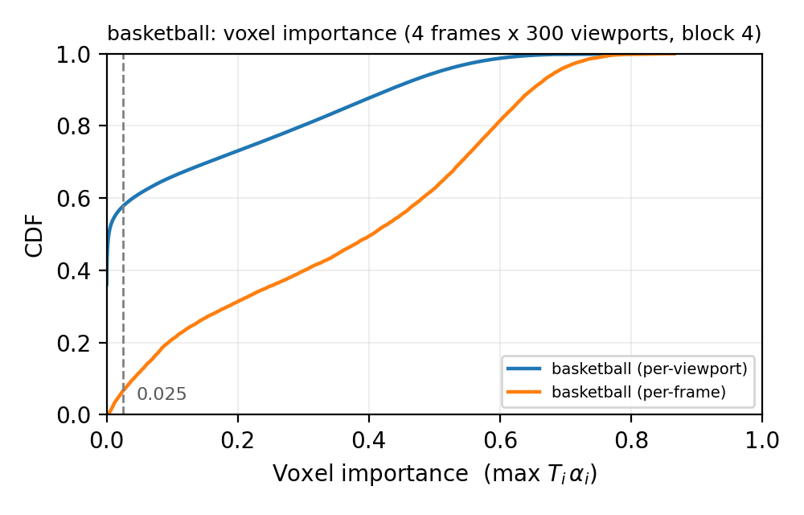
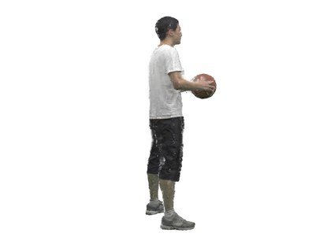
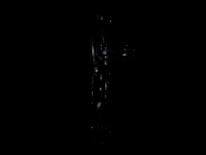
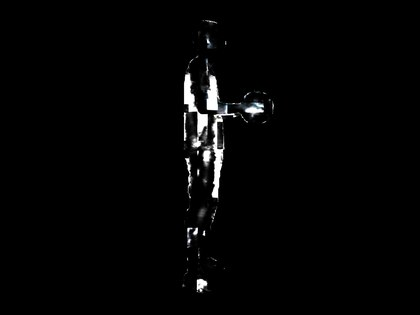
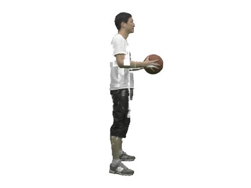

# Steps 1-2: does the importance long tail reproduce?

**The mechanism reproduces, at roughly the scale claimed.** Judged by the
paper's own criterion -- the largest threshold whose *worst* viewport still
clears SSIM 0.98 -- filtering by neural visibility discards, at ReRF's own
8<sup>3</sup> codec block, **49.2%** of `g_dancer`'s non-empty feature voxels
and **55.8%** of `g_basketball`'s, with no visible change. At a 4<sup>3</sup>
unit it is **64.0%**, and on a better-reconstructed version of the same
subject **69.0%**. The paper claims ~60%; the honest reading is that ~60% is
the right order and the exact figure is a property of the setup.

**Two caveats, both of which change how step 3 should be built.** First, the
SSIM 0.98 bar those figures are measured against passes renders with visible
block artefacts -- see below -- so they are an upper bound on what a viewer
would accept, not an estimate of it. Second, the route the ~60% is usually
quoted by does not survive contact: "~60% of
voxels below 0.025" slides from 42% to 77% purely with how big a "feature
voxel" is defined to be, which the paper never pins down; and the paper does
not hold 0.025 fixed either, since section 3.2 *fits* the threshold per video
against an SSIM target. On this content the fitted threshold is 0.2, eight
times the quoted one, and 0.025 leaves ~19 points of saving unclaimed. Treat
the quality bar as the claim and the threshold as an output.

Primary corpus: `ORBIT_datasets_gaussian` -> `g_basketball` and `g_dancer`, 4
trained ReRF frames each (1 I-frame + 3 P-frames). A mesh-rendered corpus of
the same subject is reported alongside as a robustness check. Raw output in `~/nevo_results/`; the same
material is browsable via `orbitnevo/report.py`.

## First: is the instrumentation measuring ReRF, or measuring itself?

Two checks, both run by `--verify`, both on an I-frame *and* a P-frame -- their
models are assembled differently (a P-frame's feature grid is a residual over
a motion-compensated predecessor), so one does not cover the other.

| check | I-frame 0 | P-frame 1 |
| --- | --- | --- |
| our marched weights vs. `DirectVoxGO.forward`'s | identical, max abs diff **0.0** over 2,634,697 samples | identical, **0.0** over 3,444,294 samples |
| reloaded frame rendered at a training view | **38.22 dB** | **37.98 dB** |

The first says `nevo/importance.py`'s transcription of ReRF's ray marching is
the same computation the vendored model does, so the weights being scattered
are the ones that actually rendered the frame. The second is the check that
matters more, because the first compares a model against *itself* and would
pass just as happily on a model reassembled wrongly from its checkpoint.

## The distribution

Per-viewport pooling -- every (voxel, viewport) pair is one sample, which is
what a single fetch can skip and therefore what converts to a bandwidth
saving. 300 sampled viewports per frame, importance = `max T_i * alpha_i` over
the samples in a voxel, over non-empty voxels only.

| feature voxel | edge | non-empty | <0.01 | **<0.025** | <0.05 | never hit | median |
| --- | --- | --- | --- | --- | --- | --- | --- |
| 1 grid entry | 8.4 mm | 738k | 74.6% | **76.6%** | 79.4% | 52.1% | 0.0000 |
| 2<sup>3</sup> entries | 17 mm | 117k | 64.9% | **67.5%** | 70.6% | 43.8% | 0.0008 |
| 4<sup>3</sup> entries | 34 mm | 20.5k | 52.6% | **55.6%** | 58.9% | 33.3% | 0.0087 |
| 8<sup>3</sup> (ReRF's codec block) | 67 mm | 4.1k | 38.9% | **41.8%** | 44.6% | 22.9% | 0.0908 |



Shape-wise this is Figure 7: a near-vertical rise off zero, a knee well below
0.1, then a flat tail to 1.0. The median voxel at entry granularity scores
0.0000 and at 4<sup>3</sup> scores 0.0087 -- two to three orders of magnitude
below the voxels carrying the image.

### Why granularity decides the number

Importance is a *max* over the samples in a voxel, so coarsening can only
raise it. An 8<sup>3</sup> block spans 67 mm of a 1.9 m subject and almost
always contains some front-facing surface; one visible sample makes the whole
block important. That is not an artefact of this setup, it is what the metric
is, and it means "N% of voxels are below a threshold" is a statement about the
filtering unit as much as about the content.

Both ends are real engineering options, not just axis choices. Filtering at
8<sup>3</sup> is free because that is already the unit ReRF encodes and masks
(`codec/compress.py` splits the volume into 8<sup>3</sup> blocks and ships a
per-block bitfield). Filtering finer needs a sub-block mask the bitstream does
not currently carry.

### What the tail is made of

`never hit` is the share of voxels no surviving sample touched at all --
outside the frustum, or fully behind an opaque surface. At 4<sup>3</sup> that
is 33.3 of the 55.6 points. The remaining ~22 points are voxels that *were*
sampled but contribute negligibly: the part a plain frustum-and-occlusion test
would miss, and the part that justifies computing neural visibility rather
than reusing ViVo's position-based test.

## Second: what does filtering actually cost?

The CDF only says voxels score low. This renders each viewport twice -- whole
grid vs. everything below a threshold dropped -- and scores the pair. Dropped
blocks are written back the way ReRF's decoder fills a block that never
arrived (raw density -4.1, zero features), not zeroed; raw density 0 activates
to a visible alpha and would paint fog. 8<sup>3</sup> blocks,
`orbitnevo/filter_sweep.py`. "Lossless" means the *worst* of the sampled
viewports still cleared SSIM 0.98, the bar the paper cites.

`g_basketball`, gaussian corpus:

| threshold | dropped | SSIM | worst SSIM | PSNR | |
| --- | --- | --- | --- | --- | --- |
| 0.01 | 33.5% | 0.9998 | 0.9997 | 56.4 dB | lossless |
| **0.025** (the quoted one) | **37.2%** | 0.9997 | 0.9993 | 54.1 dB | lossless |
| 0.05 | 41.0% | 0.9993 | 0.9983 | 49.1 dB | lossless |
| 0.1 | 46.0% | 0.9977 | 0.9957 | 41.2 dB | lossless |
| **0.2** | **55.8%** | **0.9921** | **0.9864** | 31.9 dB | **lossless** |
| 0.35 | 68.8% | 0.9828 | 0.9759 | 26.5 dB | degraded |
| 0.5 | 83.4% | 0.9715 | 0.9626 | 22.8 dB | degraded |
| 0.7 | 97.4% | 0.9620 | 0.9506 | 19.7 dB | degraded |

`g_dancer`, same corpus and settings, for a second object:

| threshold | dropped | SSIM | worst SSIM | |
| --- | --- | --- | --- | --- |
| 0.025 | 32.4% | 0.9997 | 0.9994 | lossless |
| 0.1 | 41.0% | 0.9978 | 0.9937 | lossless |
| **0.2** | **49.2%** | **0.9944** | **0.9873** | **lossless** |
| 0.35 | 62.5% | 0.9856 | 0.9760 | degraded |

Same fitted threshold (0.2), six points less droppable. Content-dependent, as
the paper's own per-video threshold tuning implies.

`g_basketball` again on the mesh corpus (48 views over four elevations instead
of 8 on one ring), which reconstructs the subject better:

| threshold | dropped | SSIM | worst SSIM | |
| --- | --- | --- | --- | --- |
| 0.025 | 41.6% | 0.9999 | 0.9998 | lossless |
| 0.2 | 55.9% | 0.9976 | 0.9955 | lossless |
| **0.35** | **69.0%** | **0.9918** | **0.9881** | **lossless** |
| 0.5 | 86.7% | 0.9817 | 0.9775 | degraded |

The gap between the two corpora -- 55.8% vs 69.0% on identical subject motion
-- is the interesting part. It is
*not* that the sparse rig scores voxels differently; the CDFs are within three
points of each other everywhere. It is that an 8-view reconstruction carries
more marginal, low-confidence geometry that is nonetheless load-bearing for
the image, so pushing the threshold hurts sooner.

You can see it directly. A viewpoint halfway between two of the corpus's eight
cameras -- one the model never saw:



The silhouette and the ball are clean, but the shorts and shins are mottled:
low-confidence volume the rig could not pin down, which still contributes to
the pixels. That is the material a higher threshold starts eating.

**Filtering headroom is a property of the reconstruction, not just of the
metric** -- worth remembering before quoting any single bandwidth-saving
figure, and a reason `report.py` puts a novel view on the page next to the
training view.

### Granularity buys headroom here too

Running the same sweep at a 4<sup>3</sup> filtering unit on `g_basketball`:
the largest lossless threshold moves to 0.1 and drops **64.0%**, against
55.8% at 8<sup>3</sup>. Consistent with the CDF -- a finer unit isolates the
invisible content instead of averaging it with a visible neighbour -- and it
puts a number on what a sub-block mask would be worth: about 8 points of extra
saving, in exchange for a mask ReRF's bitstream does not currently carry.

| filtering unit | best lossless threshold | dropped |
| --- | --- | --- |
| 8<sup>3</sup> (what ReRF already masks) | 0.2 | 55.8% |
| 4<sup>3</sup> (needs a sub-block mask) | 0.1 | 64.0% |

Note the fitted threshold *falls* as the unit gets finer (0.2 -> 0.1) while
the saving rises. Anyone carrying a single hard-coded threshold across
granularities will get both numbers wrong.

### The SSIM 0.98 bar is too loose for this kind of error

Worth stating plainly, because it undercuts the tidy answer above. Here is the
difference between the unfiltered and filtered render, amplified 8x, at the
quoted threshold and at the fitted one:

| 0.025 -- SSIM 0.9999, 49.4% dropped | 0.2 -- SSIM 0.9967, 64.9% dropped |
| --- | --- |
|  |  |

Both clear SSIM 0.98 comfortably, and by that measure they are 0.003 apart.
They are not remotely equivalent to look at. At 0.025 the residual is faint,
unstructured noise. At 0.2 it is *coherent 8<sup>3</sup> blocks* -- you can
count them on the torso, the forearm and the shins -- and they are visible in
the filtered render itself, not only in the amplified difference:



This is the classic failure mode of SSIM: it is computed over a local window
and forgives error that is spatially coherent, which is exactly the shape of
error that dropping a *block* produces. So the "largest lossless threshold"
figures above (55.8%, 64.0%, 69.0%) should be read as **what the paper's
stated criterion permits, not as what a viewer would accept**. Under a bar
that penalises structure -- LPIPS, which the paper also reports -- the fitted
threshold and the saving will both come down.

This is not an argument against the mechanism. At 0.025 the filter is
genuinely invisible and still removes 37-49%. It is an argument against
fitting the threshold on SSIM alone, which is what step 6 was going to do.

This is a diagnostic with perfect knowledge of the viewport being rendered. It
is an upper bound: the real system filters against a viewport *predicted*
several frames ahead, which is what step 4 introduces.

## Sensitivity checks

Where the viewer stands barely matters. Both 4<sup>3</sup>, 300 viewports,
gaussian corpus:

| viewer spread | radius (x rig) | elevation | <0.025 (gaussian) | <0.025 (mesh) |
| --- | --- | --- | --- | --- |
| tight -- orbiting at capture distance, near eye level | 0.95-1.15 | -10 to 25 deg | 54.5% | 57.0% |
| default | 0.75-1.45 | -25 to 55 deg | 55.6% | 57.8% |
| wide | 0.6-2.0 | -40 to 70 deg | 56.8% | 58.7% |

Two points across a range of viewer positions far wider than anyone actually
watches from. Granularity is the whole story.

Nor does the *reconstruction* move it much. The same sweep on a corpus built
by re-rendering the ORBIT meshes on a 48-camera, four-elevation rig (rather
than the prepared 8-view horizontal ring):

| feature voxel | gaussian corpus, 8 views | mesh corpus, 48 views |
| --- | --- | --- |
| 1 grid entry | 76.6% | 79.5% |
| 2<sup>3</sup> | 67.5% | 70.5% |
| 4<sup>3</sup> | 55.6% | 57.8% |
| 8<sup>3</sup> | 41.8% | 42.4% |

Two to three points, always in the same direction: the sparser rig produces a
slightly *tighter* reconstruction with fewer dim voxels to discard. Worth
knowing, not worth worrying about.

Assignment rule, at 8<sup>3</sup>: charging a sample to the voxel it sits in
gives 41.8% (gaussian) / 42.4% (mesh); charging it to all eight entries its
trilinear interpolation reads gives 38.1% / 38.8%. Trilinear is the stricter notion ("which
voxels does rendering this actually depend on") and finds fewer droppable. The
paper's wording -- "sampled points inside it" -- is the former, so that is the
default.

## Per-frame pooling, for contrast

Scoring each voxel by its best viewport over the whole sequence: 14.2% below
0.025 at entry granularity, 5.2% at 8<sup>3</sup>. That is the fraction never
worth sending *from any angle* -- a storage question, not a streaming one.
Quoting it as the bandwidth saving would be a 30-to-60-point mistake, which is
why both are reported.

## One thing that surprised us

ReRF's two "is anything here" tests disagree by six orders of magnitude. The
codec keeps a block when some entry's raw density clears ~3.39
(`softplus(d - 4.1) > 0.4`, `compress_utils.get_masks`); the renderer keeps a
*sample* when its alpha clears `fast_color_thres = 1e-4`, i.e. raw density
above about -4.6. Low-density haze renders but is never transmitted. At
8<sup>3</sup> that leaks ~1% of the total rendered weight, at entry
granularity ~14%. Upstream's behaviour, not something NeVo introduces, but it
caps what any block-level filtering can preserve; reported per frame in
`importance_cdf_*.json` as `weight_outside_codec_mask`.

## Verdict for step 3 onwards

Worth building on. Two things the rest of the simulator should carry rather
than assume:

1. **Filtering granularity is a first-class config flag**, not a constant. A
   bandwidth saving reported without it is meaningless. The honest default is
   8<sup>3</sup>, because that is what ReRF can actually mask and drop -- but
   4<sup>3</sup> is worth ~8 more points if step 3 is willing to carry a
   sub-block mask, and that is a real design decision, not a free parameter.
2. **The threshold is fitted, but not on SSIM alone.** The paper's own
   `Loss = SSIM_T - SSIM_C` is the right shape, and hard-coding 0.025 leaves
   ~19 points unclaimed on this content (37.2% vs 55.8%). But SSIM 0.98
   passes renders with plainly visible block artefacts (above), so step 6
   should fit against LPIPS or a structure-aware bound and treat SSIM as a
   floor rather than the target.
3. **Report the reconstruction alongside the saving.** The same metric, the
   same threshold policy and the same subject give 55.8% or 69.0% depending on
   how well the NeRF was fit. A saving quoted without that is not comparable
   to anyone else's.

## Reproducing

```bash
conda activate pytorch
python -m baselines.NeVo.orbitnevo.prepare --objects basketball --output-dir ~/nevo_data_g
conda activate nevo
python -m baselines.NeVo.orbitnevo.train --corpus ~/nevo_data_g/basketball \
    --expname g_basketball --frames 24
for B in 1 2 4 8; do
  python -m baselines.NeVo.orbitnevo.importance_cdf \
      --config baselines/NeVo/rerf/configs/nevo/g_basketball.py \
      --out ~/nevo_results/g_basketball --viewports 300 --block-size $B \
      --tag block$B --verify
done
python -m baselines.NeVo.orbitnevo.filter_sweep \
    --config baselines/NeVo/rerf/configs/nevo/g_basketball.py \
    --out ~/nevo_results/g_basketball
python -m baselines.NeVo.orbitnevo.report --out ~/nevo_report --serve 8752
```
